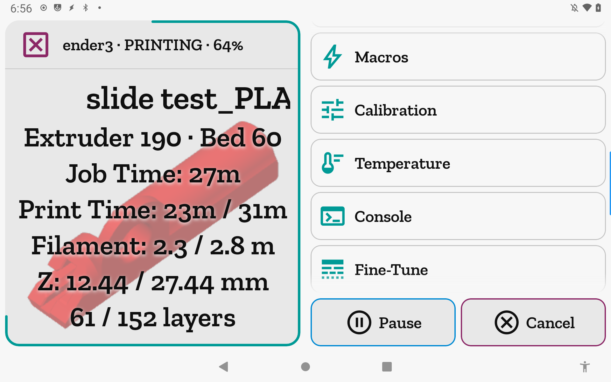
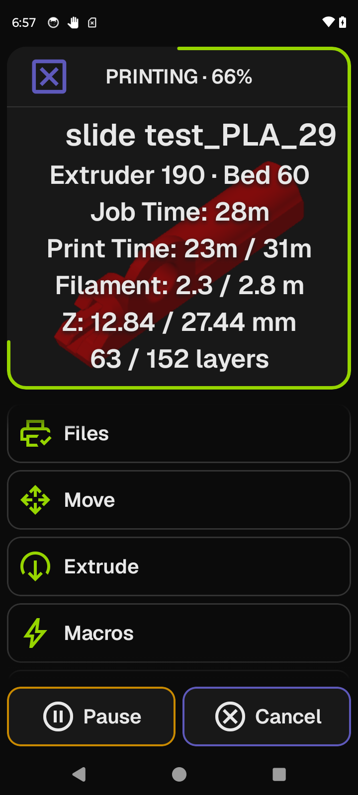

<p align="center">
  <picture>
    <source media="(prefers-color-scheme: dark)" srcset="img/jiib_name_icon_stack.svg">
    
  </picture>
</p>

<p align="center"><strong>A native Android touchscreen for your Klipper 3D printer.</strong></p>

jiib turns a cheap, old Android tablet (think Nexus 7 2013) into a dedicated, always-on
control surface for a [Klipper](https://www.klipper3d.org/) printer. It talks directly to
the [Moonraker](https://moonraker.readthedocs.io/) API over your LAN — no KlipperScreen,
no Linux host, no VNC/XSDL/X11 glue. Just install one APK, point it at your printer, and
drive a print.

> Status: **public alpha** — grab
> [ALPHA-26.7.3.1](https://github.com/mrmees/jiib/releases/tag/ALPHA-26.7.3.1) from
> Releases. The core **connect → monitor → control-a-print** loop is the priority and is
> the thing that must work flawlessly on old hardware.

## Features

- **Direct Moonraker control** over your local network (WebSocket + REST).
- **Print monitoring & control** — start, pause, resume, cancel; live temps, position,
  progress, and gcode thumbnails.
- **Motion, temperature, extrusion, and fine-tune** controls built for touch.
- **Lists-first UI** that works in both **portrait and landscape**.
- **Theming** — dark, light, and custom themes, plus an adjustable text size.
- **Runs on old hardware** — designed against a Nexus 7 2013 (Adreno 320 / 2GB) as the
  performance floor, but scales up to modern phones and tablets.

## Compatibility

- **Android 6.0+** (minSdk 23).
- Built and tested against modern devices down to a Nexus 7 2013.
- **No Google Play Services required** — the build is GMS-free and sideloaded, so it runs
  on bare AOSP / LineageOS.

## Install

1. Download the APK for your device's CPU from the
   [Releases](https://github.com/mrmees/jiib/releases) page:
   - `armeabi-v7a` for older 32-bit devices (e.g. Nexus 7 2013).
   - `arm64-v8a` for modern 64-bit phones and tablets.
2. Allow installation from unknown sources on the device.
3. Open the APK to install, launch jiib, and enter your printer's Moonraker host
   (and API key only if your Moonraker requires one — trusted-client LAN setups don't).

## Screenshots

<table><tr>
<td valign="top"></td>
<td valign="top"></td>
</tr></table>

The same print, monitored from a 2013 tablet (landscape, light theme) and a modern phone
(portrait, dark theme). **[Browse the full gallery →](docs/screenshots/README.md)** — every
screen, with instructions for each — and the [user manual](docs/manual/README.md) documents
every option.
## Build from source

Requirements: JDK 17+ and the Android SDK (compileSdk 36, build-tools 34).

```bash
git clone https://github.com/mrmees/jiib.git
cd jiib

# Debug build (auto-signed, installable):
./gradlew :app:assembleDebug

# Release build (R8-minified; produces per-ABI APKs under app/build/outputs/apk/release/):
./gradlew :app:assembleRelease
```

The release split produces one APK per ABI (`armeabi-v7a`, `arm64-v8a`). Release APKs are
unsigned by the default build — sign them with your own keystore (`apksigner`) before
installing, or use the published, signed APKs from Releases.

## Tech stack

Kotlin · Jetpack Compose + classic Views hybrid · OkHttp (WebSocket) + Retrofit (REST) ·
kotlinx.serialization · Coroutines/Flow · Coil. See `docs/adr/0001-ui-toolkit-decision.md`
for the UI-toolkit rationale and `docs/ui_design/` for the design system.

## License

[GPLv3](LICENSE).
