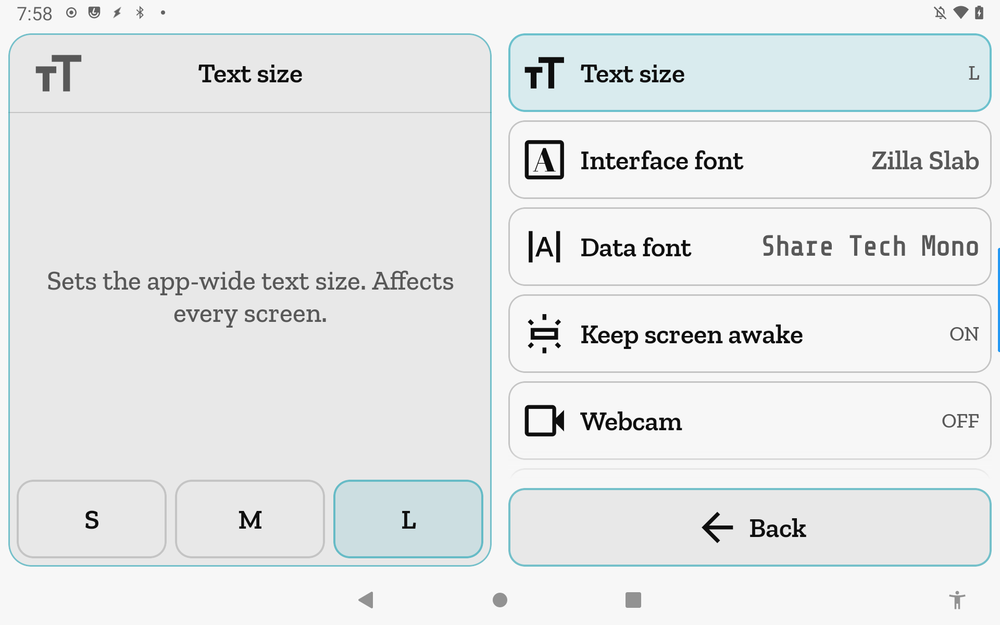

# App Settings

App-wide preferences that follow the device, not the printer. Changes here apply across
every printer profile.

**Getting there:** Home → System → App Settings.

## The screen

The Focus card shows an overview placeholder when no row is selected. Tap a row to select
it; the Focus card swaps to that setting's description and control. The list holds nine rows, each
showing the setting name on the left and the current value on the right.

Interface font and Data font navigate directly to their own selection screens rather than
loading a Focus control — tapping either row leaves this screen.

The foot bar has a single button: **Back**.

## Options & controls

### List rows

- **Text size** — sets the app-wide type scale to **S**, **M**, or **L**. Selecting this row
  loads a three-button selector in the Focus card; the active size fills with the accent color.
  Default: M. Previously per-printer; now a single app-global setting.

- **Interface font** — the typeface used for labels, buttons, and all UI copy. Tapping this
  row opens the Interface font selection screen. The row indicator shows the current font's
  name, rendered in that font. Default: Geist.

- **Data font** — the typeface used for live numeric readouts and tabular data. Tapping this
  row opens the Data font selection screen. The row indicator shows the current font's name,
  rendered in that font. Default: Geist Mono.

- **Keep screen awake** — when enabled, holds the screen awake while jiib is in the foreground.
  Selecting this row loads a toggle in the Focus card. Default: on. Turn off to let the device
  follow its normal screen timeout.

- **Webcam** — app-global switch for the webcam feature. When off, the webcam tile and
  surface are hidden across all screens. When on, the tile still only appears when the active
  printer has at least one configured camera. Selecting this row loads a toggle in the Focus card.
  Default: on. This setting moved from per-printer to app-global in v0.1.0.

- **Show unsupported tools** — when off (the default), calibration and probe screens for
  tools not detected in the active printer's hardware are suppressed. Turn on to show all
  tools regardless of whether the printer reports the required hardware. Selecting this row
  loads a toggle in the Focus card. Default: off.

- **Live Z Adjust** — controls the Z-babystep row that appears on the home screen during the
  first layers of a print. Selecting this row loads two controls in the Focus card: a toggle to
  enable or disable the row entirely, and a stepper for the layer-count window (the number
  of layers during which the row is shown). The stepper is disabled while the toggle is off.
  Layer count minimum is 1; default is 5. The row indicator shows "OFF" when disabled, or
  the current layer count when enabled.

- **Android Battery** — requests that Android exempt jiib from battery optimization,
  which prevents the OS from suspending the app's background work (websocket keepalive,
  reconnect logic) when the screen is on but the device is idle. Selecting this row loads a
  description in the Focus card and a **Allow background connection** button. The button is disabled and the
  description changes when the exemption is already granted. The row indicator is shown in
  green when exempt and in the secondary text color otherwise. Tapping the button asks Android
  to exempt jiib directly via a system dialog; on devices where that API is unavailable it
  falls back to opening the battery optimization settings screen.

- **Theme dev widgets** — enables a theme development widget used for testing color and token
  changes. Not needed for normal printer operation. Selecting this row loads a toggle in the
  Focus. Default: off.

### Foot bar

1. **Back** — returns to the System screen (accent intent).

## Related

- [Concepts](concepts.md) — gating, e-stop, and the Focus / Field screen grammar.
- [Printer Settings](printer-settings.md) — per-printer configuration: connection, theme,
  heat presets, increment values, system info, and power controls.
