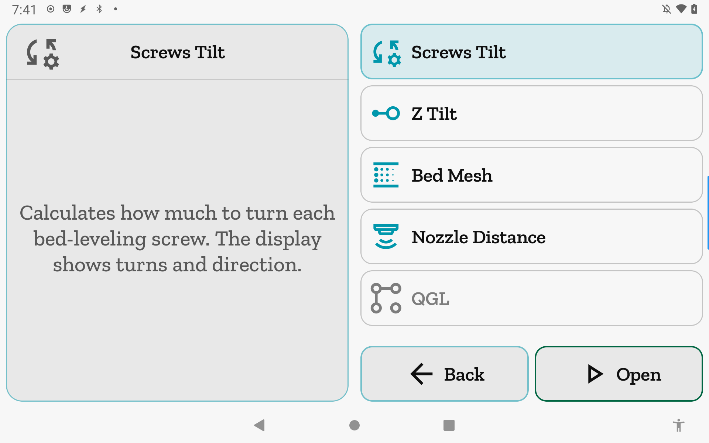
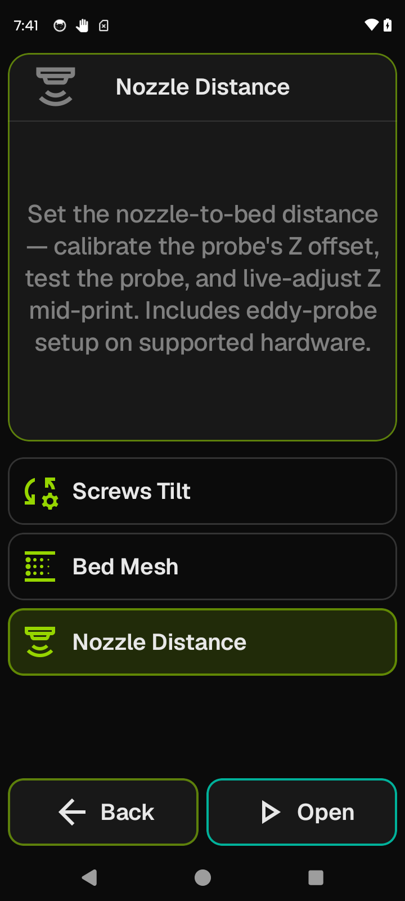

# Calibration

<table><tr>
<td valign="top"></td>
<td valign="top"></td>
</tr></table>

A hub for the printer's leveling and probing tools. Select a routine from the list to read
its description, then tap **Open** to run it.

**Getting there:** Home → Calibration (list row).

## The screen

The **Focus card** header tracks whichever routine is selected — the header icon and title
change to match. The content area below the header shows that routine's plain-language
description. On first load the first available routine is pre-selected, so the Focus card is
never blank.

The **list** shows one row per calibration routine. Supported routines appear at the top in
accent color; unsupported ones are hidden by default (see [Show unsupported tools](#show-unsupported-tools)
below). Tap any row to select it and load its description into the Focus card.

The **foot bar** holds two buttons: **Back** and **Open**. Open appears whenever a routine
is selected (which is always the case if the list is non-empty).

## Options & controls

### List rows

Each row represents one calibration routine. The routine is shown only if your printer
reports the required Klipper object in `printer.objects.list` (unless "Show unsupported
tools" is on — see below).

- **Nozzle Distance** — set the nozzle-to-bed distance: calibrate probe Z offset, test the
  probe, and live-adjust Z mid-print. Includes eddy-probe setup on supported hardware.
  Gates on the `probe` object being present; navigates to the Nozzle Distance screen.

- **Bed Mesh** — probe the bed surface and store or load height-compensation mesh profiles.
  Gates on the `bed_mesh` object being present; navigates to the Bed Mesh screen.

- **Screws Tilt** — calculate how much to turn each bed-leveling screw for a level bed,
  with turn count and direction shown. Gates on the `screws_tilt_adjust` object being
  present; navigates to the Screws Tilt screen. Sends `SCREWS_TILT_CALCULATE`; requires
  `[screws_tilt_adjust]` in your Klipper config.

- **Z Tilt** — automatically adjust multiple Z-axis motors so the gantry is level; may
  iterate. Gates on the `z_tilt` object being present; navigates to the Z Tilt screen.
  Sends `Z_TILT_ADJUST`; requires `[z_tilt]` in your Klipper config.

- **QGL** — level a CoreXY printer's four-point gantry automatically; may iterate. Gates on
  the `quad_gantry_level` object being present; navigates to the QGL screen. Sends
  `QUAD_GANTRY_LEVEL`; requires `[quad_gantry_level]` in your Klipper config.

Routine availability is re-evaluated live: if the printer reconnects with different
capabilities, the list updates immediately.

### Show unsupported tools

By default, routines your printer does not support are hidden entirely. Turn on **Show
unsupported tools** in App Settings to reveal all five routines — unsupported ones are
dimmed (greyed icon and label) but are still selectable and can be opened. This toggle
lives in App Settings, not per-printer settings, and applies to all calibration hubs.

### Foot bar

- **Back** — returns to Home. Always the first button (accent styling).
- **Open** — opens the selected routine's dedicated screen (green styling, the expected
  action). Present whenever a routine is selected; absent only if the list is empty (all
  routines unsupported and "Show unsupported tools" is off). With two buttons, both show
  icon and label.

## Related

[Concepts](concepts.md) · [Bed Mesh](bed-mesh.md) · [Nozzle Distance](nozzle-distance.md)
