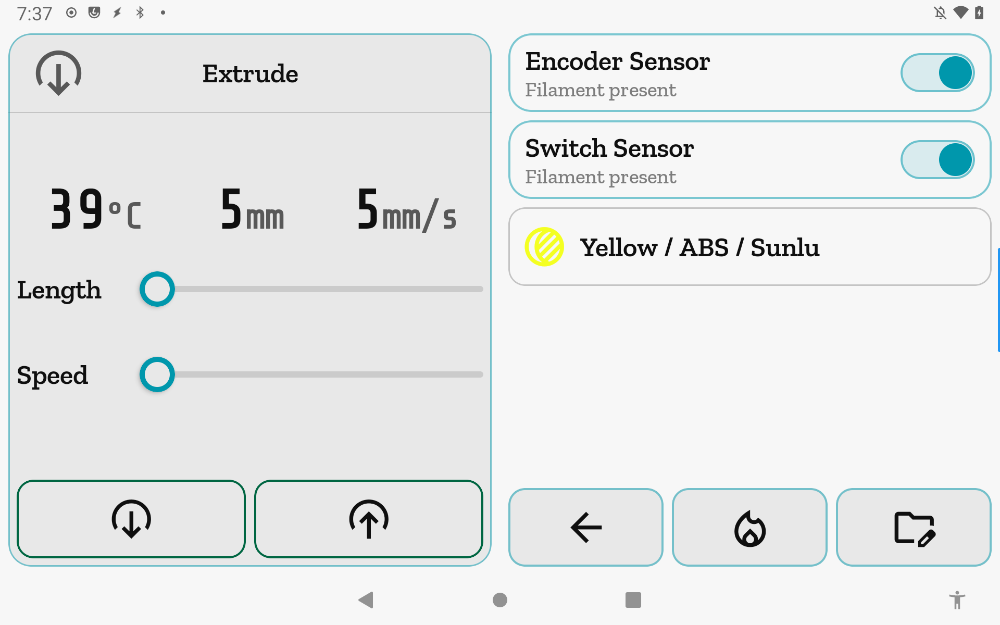
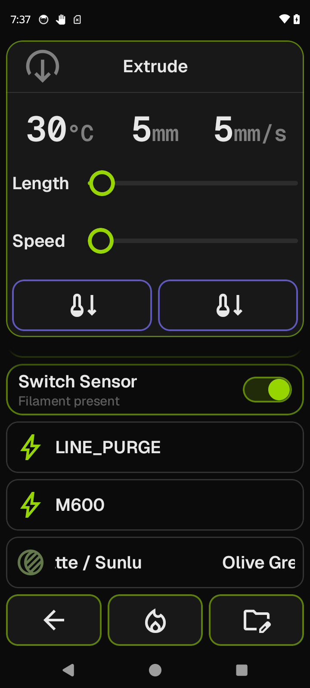

# Extrude

The filament hub. Load, unload, extrude, retract, manage runout sensors, and jump to the
Spoolman library — all from one screen.

**Getting there:** Home → Extrude (tap the row in the home list).

## The screen

The **Focus card** is a feed surface for direct filament movement: a live info line (nozzle
temperature, selected length, selected speed), two sliders (Length and Speed), and a pair
of large command buttons — **Extrude** and **Retract** — that fill the bottom of the card.
On multi-extruder printers, a tool selector row (T0 / T1 / …) appears at the top of the
Focus card.

The **list** holds everything filament-adjacent in a fixed order: runout sensor toggles,
**Load** / **Unload** macro rows, any macros you have pinned to this screen, and the
Spoolman spool row at the bottom.

The **foot bar** has three buttons: **Back**, **Heaters**, and **Macros**. Heaters and
Macros replace the list with an in-place takeover panel; Back in each takeover returns to
the main list.

## Options & controls

### Focus card

- **Tool selector** — appears only when Klipper reports more than one extruder. Tap a tab
  (T0, T1, …) to switch the active extruder; the cold-extrude gate, nozzle temperature,
  and slider caps update to that extruder's live state. Dims while a tool-switch is in
  flight.
  > Sends `T<index>`; gated on `[extruder]` being present in the printer object list.

- **Info line** — three read-only values in a row: current nozzle temperature in °C, the
  slider-selected length in mm, and the slider-selected speed in mm/s. These are values
  only; the units label each one. Temperature is the live current reading, not the target.

- **Length slider** — sets the distance (mm) for the next Extrude or Retract. Range: 1 mm
  to 100 mm, further capped to the printer's `max_extrude_only_distance` if that value is
  lower. Default 5 mm at screen entry. The slider pulls the value back down automatically
  if the printer reports a lower ceiling after the slider was set.

- **Speed slider** — sets the feedrate (mm/s) for the next Extrude or Retract. Range: 1
  mm/s to the printer's `max_extrude_only_velocity` (fallback 15 mm/s if the printer has
  not reported one, capped at 100 mm/s). Default 5 mm/s at screen entry. The slider pulls
  the current value down automatically if the printer reports a lower ceiling after the
  slider was set.

- **Extrude** — feeds the currently selected length of filament at the selected speed.
  When the nozzle is warm enough (`can_extrude` true from Klipper): green intent,
  `output_circle` glyph, tappable. When cold: red intent, `thermostat_arrow_down` glyph,
  disabled — the button appearance IS the cold-extrude warning. Dims while the dispatch is in flight.
  > Sends `SAVE_GCODE_STATE NAME=dd_ext`, `M83`, `G1 E<mm> F<feedrate>`,
  > `RESTORE_GCODE_STATE NAME=dd_ext`, `M400`; gated on `[extruder]`.

- **Retract** — pulls filament back by the selected length and speed. Same cold-extrude
  gate and visual behavior as Extrude: disabled and red when cold, dims while in flight.
  > Sends the same sequence as Extrude with a negative `E` value.

### List

- **Runout sensor toggles** — one `ToggleRow` per filament sensor Klipper reports. The row
  label is the Klipper section name (underscores and dashes replaced with spaces,
  title-cased). Below the label, a sub-label reads **Filament present** or **No filament**
  from the sensor's live state; absent when the sensor has not yet reported filament
  presence. The toggle enables or disables the sensor. This entire section is hidden when
  the printer has no filament sensors configured. Each toggle is disabled while a
  dispatch to that sensor is in flight.
  > Sends `SET_FILAMENT_SENSOR SENSOR=<name> ENABLE=0|1`; gated on
  > `SET_FILAMENT_SENSOR` being a known g-code command.

- **Load** — runs your printer's `LOAD_FILAMENT` macro. This row is hidden when
  `LOAD_FILAMENT` is not present in the Klipper config (Moonraker's `printer.objects.list`
  is checked at connect; the match is case-insensitive).
  > Sends `LOAD_FILAMENT`; gated on that macro being present in the config.

- **Unload** — runs your printer's `UNLOAD_FILAMENT` macro. Same gating as Load; hidden
  when the macro is absent.
  > Sends `UNLOAD_FILAMENT`; gated on that macro being present in the config.

- **Pinned macro rows** — macros you have added via the **Macros** foot bar panel (see
  below). Each row runs the macro bare by name on tap. A row dims while its dispatch is
  in flight. `LOAD_FILAMENT` and `UNLOAD_FILAMENT` are never shown here even if pinned
  (they appear as their own dedicated rows above).
  > Each pinned macro is sent via `printer.gcode.script`; runs as `SoftBusy` (the busy
  > overlay fires but there is no hard fence).

- **Spool row** — the Spoolman spool currently linked to the active printer. Shows the
  spool's name, material, and vendor (joined with " / "); **No Spool Loaded** when nothing
  is linked; **Spool** when a spool is linked but carries none of those fields. The spool
  icon is tinted to the filament's color. Tap to open the Spoolman library.

### Foot bar

- **Back** — navigates back to Home.

- **Heaters** — replaces the list with an extruder-only heat panel: an **OFF** row, the
  loaded spool's recommended print temperatures (when a spool is linked), and your
  per-printer heat presets. Tapping a row sets the nozzle temperature (extruder only, not
  the bed) and returns to the main list. **Back** in the panel returns without applying a
  preset.

- **Macros** — replaces the list with the macro-pin manager. Every non-underscore-prefixed
  macro from your Klipper config is shown as a toggle. Turn a macro on to add it to the
  Extrude list; turn it off to remove it. **No macros found** is shown when Klipper reports
  no eligible macros. **Back** returns to the main list. Pins are stored per-printer in
  DataStore and persist across sessions.

## Related

[Concepts](concepts.md) — gating states, the cold-extrude safety gate, and how SoftBusy
works.
[Heaters](heaters.md) — the full heater panel (nozzle + bed together).
[Spoolman](spoolman.md) — filament inventory and spool tracking.
[Macros](macros.md) — the full macro list; pin macros there to the home list instead.
