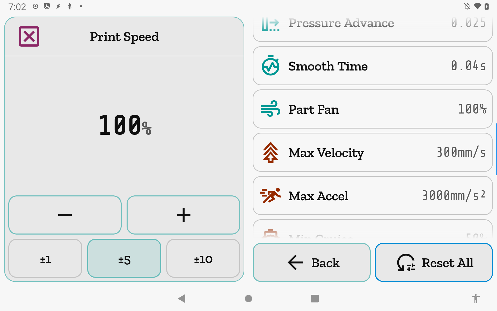

# Fine-Tune

Live adjustment of the key print parameters that matter most mid-print: speed and flow
overrides, pressure advance, part fan, and machine motion limits. Changes take effect
immediately without pausing or interrupting the print.

**Getting there:** Home → Fine-Tune (row near the bottom of the home list).

## The screen

The **Focus card** shows an adjuster for the currently selected parameter: a large value
readout with its unit, **−** and **+** buttons, and a three-step step-size picker. The Focus
card header shows the parameter's name and icon; when a print is active or paused the e-stop
control morphs into the header in place of the idle glyph.

The **list** shows every available parameter as a scrolling row. Each row has a leading icon
tinted to its group color (Extrusion / Motion / FW-Retraction), the parameter name, and the
current live value at the trailing edge. Tapping a row makes it active in the Focus card.

The **foot bar** has two buttons: **Back** (accent, leftmost) and **Reset All** (amber).

## Options & controls

### Focus card

- **− / + buttons** — Nudge the selected parameter by the active step size. Taps accumulate
  locally and send a single command per ~500 ms quiet window; the buttons dim while a command
  is outstanding but continue to accept taps.

- **Step picker** — Three step sizes per parameter (see each parameter's entry below). The
  selected step resets to that parameter's default whenever you switch to a different row.

- **Revert icon** (trailing header button) — Appears when the selected parameter's current
  value differs from its Klipper config baseline. Tap to reset that parameter alone. Not shown
  for Print Speed, Flow Rate, or Part Fan — those have no persistent config baseline in
  Klipper.

### List rows — Extrusion group

- **Print Speed** — Speed-factor override as a percentage of the slicer-requested speed.
  Steps: 1 / 5 / 10 %; default step 5 %. Range: 25–300 %. No Revert icon (no config
  baseline; Klipper reports the live override only).
  > Sends `M220 S<pct>`; requires the `gcode_move` Klipper object.

- **Flow Rate** — Extrude-factor override as a percentage of the nominal extrusion.
  Steps: 1 / 5 / 10 %; default step 1 %. Range: 50–150 %. No Revert icon (same reason as
  Print Speed).
  > Sends `M221 S<pct>`; requires the `gcode_move` Klipper object.

- **Pressure Advance** — Pressure advance coefficient (dimensionless). Steps: 0.001 / 0.005 /
  0.01; default step 0.001. Range: 0.000–1.000. Revert available when the live value differs
  from the `pressure_advance` value in your extruder config section.
  > Sends `SET_PRESSURE_ADVANCE ADVANCE=<value>`; requires the `extruder` Klipper object.

- **Smooth Time** — Pressure advance smooth time in seconds. Steps: 0.01 / 0.02 / 0.05 s;
  default step 0.01 s. Range: 0.00–0.20 s. Revert available; the baseline is read from the
  `pressure_advance_smooth_time` config key, not the live status field.
  > Sends `SET_PRESSURE_ADVANCE SMOOTH_TIME=<value>`; requires the `extruder` Klipper object.

- **Part Fan** — Part-cooling fan speed as a percentage. Steps: 1 / 5 / 10 %; default step
  5 %. Range: 0–100 %. No Revert icon (Klipper's `[fan]` section carries no persistent
  configured speed). When no `fan` object is present the value shows "—" and ± taps have no
  effect (the row remains visible).
  > Sends `M106 S<0..255>` (percent converted to 0–255 PWM range); requires the `fan` Klipper object.

### List rows — Motion group

- **Max Velocity** — Runtime maximum toolhead velocity in mm/s. Steps: 10 / 50 / 100 mm/s;
  default step 10 mm/s. Range: 1–1000 mm/s. Revert available; baseline is the `max_velocity`
  value from the `[printer]` config section.
  > Sends `SET_VELOCITY_LIMIT VELOCITY=<value>`; requires the `toolhead` Klipper object.

- **Max Accel** — Runtime maximum acceleration in mm/s². Steps: 100 / 500 / 1000 mm/s²;
  default step 100 mm/s². Range: 100–50000 mm/s². Revert available; baseline is `max_accel`
  from `[printer]`.
  > Sends `SET_VELOCITY_LIMIT ACCEL=<value>`; requires the `toolhead` Klipper object.

- **Min Cruise** — Minimum cruise ratio as a percentage (0–100 %). Controls the fraction of a
  move that must be at full speed before Klipper will apply the accel limit. Steps: 1 / 5 /
  10 %; default step 1 %. Range: 0–100 %. Revert available. The value is displayed in percent
  but sent to Klipper as a ratio (display ÷ 100).
  > Sends `SET_VELOCITY_LIMIT MINIMUM_CRUISE_RATIO=<ratio>`; requires the `toolhead` Klipper object.

- **Square Corner Vel** — Square corner velocity in mm/s; the maximum speed at which the
  toolhead may turn a sharp corner without slowing further. Steps: 0.1 / 0.5 / 1.0 mm/s;
  default step 0.1 mm/s. Range: 0.1–20.0 mm/s. Revert available; baseline is
  `square_corner_velocity` from `[printer]`.
  > Sends `SET_VELOCITY_LIMIT SQUARE_CORNER_VELOCITY=<value>`; requires the `toolhead` Klipper object.

### List rows — FW-Retraction group

These four rows are hidden entirely when `firmware_retraction` is not present in the Klipper
config. They do not appear greyed — they simply are not shown. All four values are sent
together in a single command whenever any one of them is adjusted.

- **Retract Length** — Firmware retraction distance in mm. Steps: 0.1 / 0.5 / 1.0 mm;
  default step 0.1 mm. Range: 0.0–10.0 mm. Revert available.

- **Retract Speed** — Retraction move speed in mm/s. Steps: 1 / 5 / 10 mm/s; default step
  1 mm/s. Range: 1–100 mm/s. Revert available.

- **Unretract Extra** — Extra length added on unretraction to compensate for ooze, in mm.
  Steps: 0.1 / 0.5 / 1.0 mm; default step 0.1 mm. Range: −5.0–5.0 mm. Revert available.

- **Unretract Speed** — Unretraction move speed in mm/s. Steps: 1 / 5 / 10 mm/s; default
  step 1 mm/s. Range: 1–100 mm/s. Revert available.

  > All four send `SET_RETRACTION RETRACT_LENGTH=… RETRACT_SPEED=… UNRETRACT_EXTRA_LENGTH=… UNRETRACT_SPEED=…`; requires `[firmware_retraction]` in the Klipper config.

### Foot bar

- **Back** — Returns to the home screen.

- **Reset All** — Resets every parameter that has a Klipper config baseline back to that
  baseline simultaneously. Print Speed, Flow Rate, and Part Fan are excluded from Reset All
  because they have no config baseline; their values are not changed by this button.

## Availability outside prints

Fine-Tune is accessible at any time the printer is connected, not only while a print is
running. Velocity limits, pressure advance, and retraction settings can be dialed in during
testing moves or between prints without affecting sliced files. The e-stop control in the
Focus header is visible only when a print is active or paused.

## Related

[Concepts](concepts.md) — gating overlays, e-stop behavior, and the busy-lock pattern.
[Increment Values](increments.md) — customize the three step sizes for each Fine-Tune
parameter per printer.
[Temperature](temperature.md) — live heater adjustment during a print.
