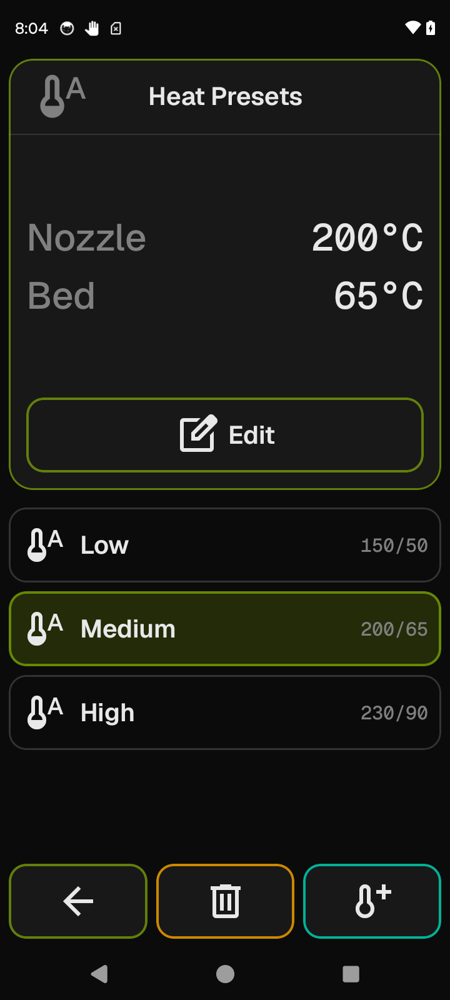

# Heat Presets

The per-printer list of named preheat presets: create, rename, and delete them here. The
presets you configure here are what appear on the [Heaters](heaters.md) screen when you
want to heat nozzle and bed in one tap.

**Getting there:** Home → System → Printer Settings → Heat Presets.

## The screen

The screen has two states that replace each other in place.

**Browsing state** — the default. The Focus card shows the setpoints of the currently
selected preset (heater label on the left, target temperature on the right; a stored value
of 0 displays as "Off"). When nothing is selected it shows a short hint instead. Below the
Focus is the list of saved presets; when no presets exist yet, the list area shows "No
presets yet — tap Add to create one." The foot bar holds Back, Delete, and Add.

**Wizard state** — entered when you tap Add or Edit. A one-step-per-page form takes over
the whole screen: step one is the preset name, then one step per settable heater. The foot
bar in the wizard holds Cancel and Next / Save.

New printers are seeded with three presets: **Low** (150 °C nozzle / 50 °C bed),
**Medium** (200 °C / 65 °C), and **High** (230 °C / 90 °C). You can edit or delete all
of them.

## Options & controls

### Focus card (browsing state)

- **Setpoints digest** — when a preset is selected, lists each heater and its stored target
  in two columns, sorted by the Moonraker object name (`extruder` before `heater_bed`,
  etc.). A stored value of 0 shows as "Off".
- **Select hint** — "Select a preset to view its setpoints" — shown when nothing is
  selected; replaced by the digest when a selection is made.
- **Edit** — an outlined button docked at the bottom of the Focus card, visible only when
  a preset is selected. Opens the wizard pre-filled with that preset's name and setpoints.

### List (browsing state)

Each row shows:
- The preset name (label, left).
- A compact temperature summary on the right — setpoint values joined by `/`, sorted by
  object name, no labels and no degree symbol (e.g. `200/65` for a nozzle/bed preset, or
  `200/65/0` if a third heater is stored as Off).

The list is sorted by primary extruder temperature ascending; presets with no extruder
setpoint appear last, then by name alphabetically within each group.

Tap a row to select it and load its setpoints into the Focus card. Tap the same row again
to keep it selected (re-tapping does not deselect). The selection carries the preset into
the Delete and Edit controls.

### Foot bar (browsing state)

1. **Back** — returns to Printer Settings (accent intent).
2. **Delete** — opens a confirmation overlay titled "Delete Preset" with the message
   `Delete "NAME"?` (curly double quotes around the preset name), a destructive Confirm
   labeled "Delete", and a Cancel. Enabled only when a preset is selected; disabled
   (greyed out) when the list is empty or nothing is selected. Styled red (destructive
   intent). After confirmation the preset is removed and the selection is cleared.
3. **Add** — opens the wizard in create mode (no pre-fill). Styled green (go intent).

### Wizard — step 0: Preset Name

- **Preset Name** field — a text input (alphanumeric keyboard) for the name this preset
  will carry in the Heaters list. Shown in error state (red outline) when blank. The Next
  button is disabled while the name is blank.

### Wizard — steps 1 … N: Heater targets

One step per settable heater on the active printer, in this order: primary extruder →
additional extruders → bed → `heater_generic` entries (alphabetically) → `temperature_fan`
entries (alphabetically). When the printer has not yet reported its config, the wizard
falls back to Nozzle + Bed so you can always build a usable preset.

Each step shows:

- **Heater name** — the heater's display name as the Focus header (e.g. "Nozzle", "Bed",
  or the bare name for `heater_generic` / `temperature_fan` objects).
- **Target °C** field — a numeric input (digits only, up to 3 digits). Leave blank to skip
  this heater — the preset will not touch it when applied. Enter `0` to explicitly set the
  heater to off when this preset fires.
- **Skip hint** — "Leave blank to skip or 0 to turn off" shown as a caption below the
  field.

Targets are clamped to the heater's `max_temp` / `min_temp` from your Klipper config on
save. A stored value of `0` bypasses the minimum clamp — it is treated as an explicit
"turn off" and is not raised to the configured minimum. For `temperature_fan` objects,
per-heater config limits are not read in v1; the global 0–350 °C range applies instead.

If you are editing a preset and one of its heaters is temporarily absent (for example
because the printer is disconnected), the saved setpoint for that heater is carried
forward unchanged as long as you do not explicitly blank or change the field for it.

### Wizard — foot bar

1. **Cancel** — discards all wizard input and returns to the browsing state without saving
   anything (red/danger intent).
2. **Next** — advances to the next heater step. Disabled while the name field is blank.
   Styled green (go intent). Visible on all steps except the last.
3. **Save** — builds and saves the preset, then returns to the browsing state with the
   saved preset selected. Styled green (go intent). Visible on the last heater step only.
   Disabled when the name is blank or when no heater target would actually be stored (a
   preset with a name but every field left blank cannot be saved). Persisted per-printer in
   DataStore. > Stored under the key `presets_<profileId>` in `heat_presets.preferences_pb`.

Wizard state (current step, entered name, entered temperatures) is preserved across
device rotation and temporary process death.

## Related

- [Heaters](heaters.md) — where you apply these presets in one tap.
- [Printer Settings](printer-settings.md) — the hub this screen is reached from.
- [Increment Values](increments.md) — similar per-printer list of editable step sizes.
- [Concepts](concepts.md) — gating, e-stop, and the Focus / Field screen grammar.
