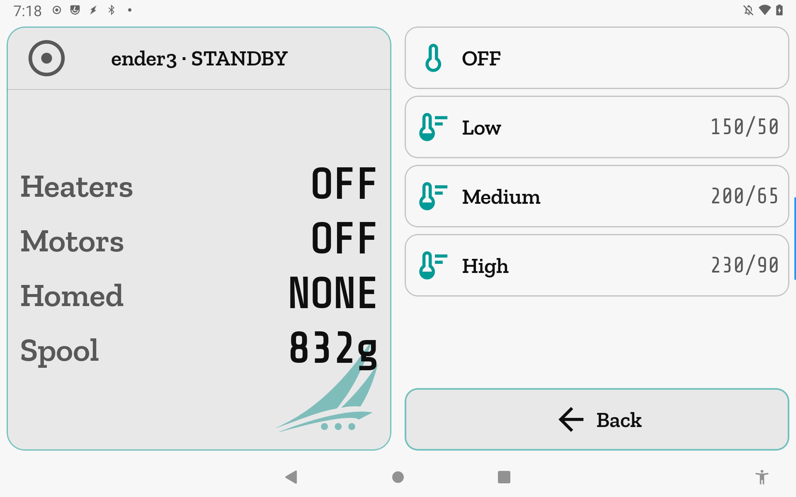
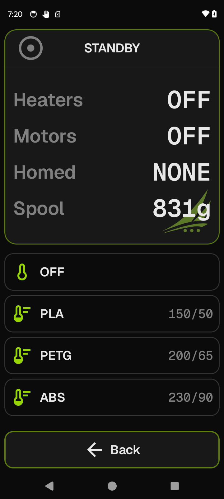

# Heaters

One-tap preset heating: tap a row to send nozzle and bed to a saved temperature pair, or
tap OFF to kill all heaters.

**Getting there:**
- **Home → Heaters** (foot bar, standby only — hidden while printing or at print-complete).
- **Extrude → Heaters** (foot bar, any time).
- **Temperature → Heaters** (foot bar in Heater Adjust mode only).

## The screen

The Heaters list is a field takeover: it replaces the scrollable list of whichever screen
opened it while the Focus card above it remains unchanged. The list contains three groups of
rows in a fixed order:

1. **OFF** — always present, pinned at the top.
2. **Loaded filament** — present only when a Spoolman spool is linked to the printer and
   that spool has at least one of a nozzle temperature or a bed temperature recorded in
   Spoolman's filament profile.
3. **Named presets** — one row per saved heat preset, sorted by primary extruder temperature
   ascending (presets with no extruder setpoint come last), then alphabetically by name.

Rows whose setpoints have no applicable heater on the current printer are omitted entirely —
no empty or greyed-out rows appear.

Tapping any row fires its command and closes the list immediately. The foot bar contains a
single **Back** button; tap it to close without applying any change.

## Options & controls

### List rows

- **OFF** — turns all heaters off. From Home and Temperature (both Full scope): sends
  `TURN_OFF_HEATERS`. From Extrude (ExtruderOnly scope): sends
  `SET_HEATER_TEMPERATURE HEATER=<active extruder> TARGET=0` — only the active extruder
  is zeroed; the bed is left alone. Requires the `extruder` Moonraker object to be present.

- **Loaded filament** — applies the nozzle and/or bed temperatures stored on the currently
  linked Spoolman spool's filament profile. The row label shows the filament material
  (`PLA`, `PETG`, etc.) when recorded in Spoolman; falls back to the filament name, then
  to "Loaded filament". The row icon is tinted with the spool's color. The trailing value
  shows the applicable setpoints in the same `extruder/heater_bed` format as presets.
  Visible only when a spool is linked; hidden on Extrude if the spool has no nozzle temp.
  Sends `SET_HEATER_TEMPERATURE` for each applicable setpoint.

- **Named preset rows** — each preset shows its name on the left and a summary of its
  setpoints on the right (values sorted by Moonraker object name, joined by `/`; for a
  standard extruder + bed setup the order is extruder then heater_bed, e.g. `200/65`).
  From Home and Temperature (Full scope): all setpoints in the preset that match a heater
  present on the printer are applied; setpoints for absent heaters are silently skipped,
  and a preset whose entire map filters to empty is omitted from the list. From Extrude
  (ExtruderOnly scope): only the preset's extruder setpoint is applied; presets with no
  extruder temperature are omitted. Presets are configured per printer in
  **Printer Settings → Heat Presets**. Sends one `SET_HEATER_TEMPERATURE HEATER=<name>
  TARGET=<temp>` per heater (or `SET_TEMPERATURE_FAN_TARGET TEMPERATURE_FAN=<name>
  TARGET=<temp>` for `temperature_fan` objects), all in a single g-code block. Requires
  the `extruder` Moonraker object to be present.

### Foot bar

1. **Back** — closes the Heaters list and returns to the normal field of the parent screen
   without dispatching any command (accent intent).

## Related

- [Heat Presets](heat-presets.md) — add, rename, and edit the presets that appear here.
- [Temperature](temperature.md) — live graph and per-heater target adjustment.
- [Extrude](extrude.md) — filament feed controls; opens the ExtruderOnly scope of this list.
- [Concepts](concepts.md) — gating, e-stop, and the Focus / Field screen grammar.
