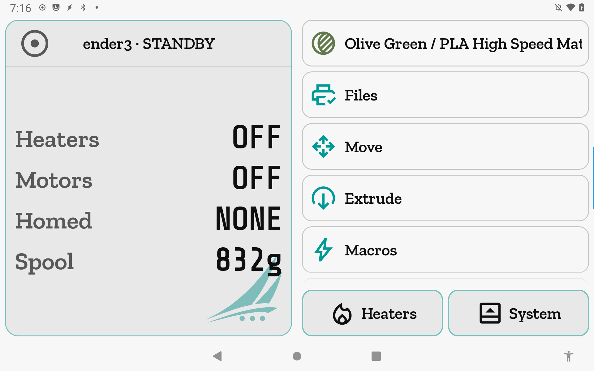
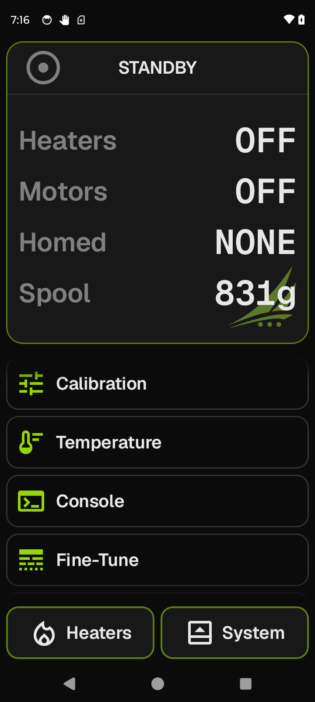

# Home

The home screen is the root of the app: a live digest of printer state in the Focus card,
and every major tool reachable from the scrolling list below it. The same screen stays
home during a print — the foot bar morphs to Pause/Cancel and the Focus card switches to
a print dashboard.

**Getting there:** Home is the start screen. Tap the icon in any screen's header to return.
Back from any top-level tool also returns here.

## The screen

The **Focus card** shows a state digest when the printer is idle: heater states, motor enable
state, which axes are homed, and the loaded spool's remaining weight. A faint watermark
(the jiib logo) sits in the bottom corner of the card.

The **list** holds one row per available tool, in fixed order. Rows whose feature is not
present on the printer (no Spoolman, no outputs, no webcam) are hidden entirely — they do
not grey out.

The **foot bar** has two buttons in standby: **Heaters** and **System**.

## Options & controls

### Focus card — standby digest

- **Heaters** — shows "OFF" when every heater's target is 0. When one or more heaters are
  active, one row appears per active heater with its prettified name (e.g., "Extruder",
  "Bed") and the value `current/target` in integer degrees, colored by each heater's
  configured trace color. Hidden heaters (target = 0) are not shown.

- **Motors** — shows "ON" or "OFF". Hidden when the printer does not report motor-enable
  state (`stepper_enable` absent from the Klipper object list).

- **Homed** — the set of homed axes, written in X/Y/Z order then any extra axes (e.g.,
  `XYZ`, `XZ`, `NONE`). Always visible.

- **Spool** — the loaded spool's remaining weight in grams (e.g., `782g`), or `N/A` when
  Spoolman is configured but no weight is available (no active spool set, spool data still
  loading, or remaining weight absent). The entire row is hidden when Spoolman is not
  configured.

### List rows

Rows appear in this order; capability-absent rows are not rendered at all:

- **Spool** — only when a Spoolman server is configured. Shows the loaded filament's name,
  material, and vendor (`name / material / vendor`), with the spool icon tinted to the
  filament's color. Shows the generic label "Spool" when a spool is loaded but carries no
  name, material, or vendor fields. Shows "No Spool Loaded" when nothing is active. Tapping
  opens the [Spoolman](spoolman.md) screen.

- **Files** — the gcode file browser. Always present.

- **Move** — toolhead movement hub. Always present.

- **Extrude** — filament hub. Always present.

- **Macros** — macro launcher. Always present, even if no macros are bookmarked; the Macros
  screen handles the no-macros case itself.

- **Calibration** — leveling and probing tools. Always present.

- **Temperature** — live temperature graph and heater-adjust mode. Always present.

- **Console** — raw printer conversation. Always present.

- **Fine-Tune** — live print-parameter adjustment. Always present; most useful while a print
  is running.

- **Outputs** — controllable outputs (fans, LEDs, servos, pins). Shown only when the printer
  exposes at least one controllable output.

- **Webcam** — live camera feed. Shown only when at least one webcam is configured AND the
  webcam feature is enabled in App Settings.

- **System** — appears in the list (not the foot bar) while printing or paused, so it stays
  reachable while the foot bar is occupied by print-state controls (Pause/Cancel or
  Resume/Cancel).

### Foot bar — standby

- **Heaters** (accent) — opens the Heaters takeover in place: the list and foot bar are
  replaced by the unified heater-preset list (OFF + named presets + loaded spool row). Tap
  any preset to apply it; Back closes the takeover and returns to the normal list. The
  takeover closes automatically when a print starts or finishes.

- **System** (accent) — navigates to the [System](system.md) screen.

### Foot bar — while printing

- **Pause** (amber) — sends `printer.print.pause` via Moonraker JSON-RPC. Requires
  `[pause_resume]` in your Klipper config.

- **Resume** (green, shown only when paused) — sends `printer.print.resume`. Requires
  `[pause_resume]`.

- **Cancel** (red) — opens a confirmation dialog before sending `printer.print.cancel`.
  Requires `[pause_resume]`.

### Foot bar — after a print completes

- **Dismiss** (green) — sends `SDCARD_RESET_FILE` to clear the finished job and return to
  standby. Requires `[virtual_sdcard]`.

- **System** (accent) — navigates to the [System](system.md) screen.

### Focus card — while printing, paused, or complete

The digest is replaced by a print dashboard: the gcode thumbnail fills the card behind a
scrim, with a centered data block showing the filename, heater temperatures, job time, print
time versus estimate, filament used versus total, Z height, and layer count. When no
thumbnail is available, the watermark is shown instead.

The header adapts to state:
- **Printing** — shows the live print percentage (e.g., `PRINTING · 42%`) and a clockwise
  accent progress ring.
- **Paused** — shows the paused percentage and an amber progress ring.
- **Complete** — shows `COMPLETE · 100%` with a checkmark icon and a full accent ring
  pinned at 100%.

The e-stop button is visible in the Focus card header while printing or paused only (it is
not shown in standby or after a print completes). See [Concepts](concepts.md) for e-stop
behavior.

## Related

[Concepts](concepts.md) — gating, e-stop, and connection states.
[Heaters](heaters.md) — the preset list opened from the Heaters foot button.
[Macros](bookmarked-macros.md) — bookmarking macros for quick access.
[System](system.md) — app and printer settings.
