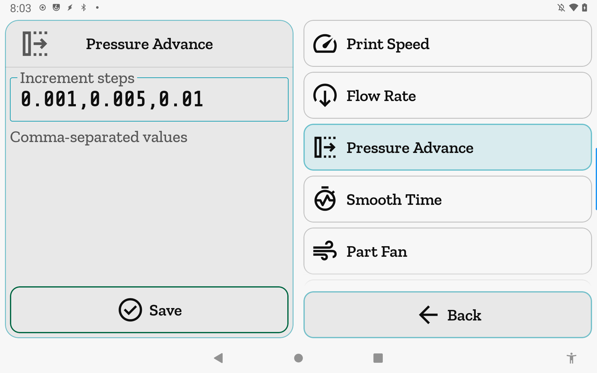

# Increment Values

Configure the step sizes offered by every adjustment control in the app. Each control gets its own comma-separated list; the values you enter become the choices available when you nudge that control.

**Getting there:** Home → System → Printer Settings → Increment Values.

## The screen

The Focus card shows an editor for whichever control is selected. Before you tap a row, the Focus card shows a "select a control" prompt. Once you select a row, the Focus card loads that control's current step list into a text field with a **Save** button docked below it.

The list holds one row per configurable control — 13 Fine-Tune parameters followed by Microstep, Babystep, and Probe Z Test. Tapping a row highlights it and swaps the Focus card to that control's editor without leaving the screen. The list stays fully visible alongside the editor.

The foot bar holds a single **Back** button.

## Options & controls

### Focus card — increment editor

- **Step list field** — Type a comma-separated list of positive numbers (e.g. `0.001,0.005,0.01`). The keyboard accepts only digits, `.`, `,`, and spaces; all other characters are dropped as you type. The field uses the text keyboard (not numeric) because a numeric keyboard cannot reliably produce the comma separator needed between values.

- **Validation hint** — Below the field, a hint line shows formatting guidance when the input is valid, or a short error message in red when it is not. Errors include: empty input, empty tokens (adjacent commas), non-numeric tokens, values of zero or below, and — for Fixed-count controls — the wrong number of values.

- **Save** (green, docked at bottom of Focus card) — Writes the canonical form of the list to this printer's stored preferences. Disabled whenever the current input does not parse cleanly. Switching to a different row discards any unsaved edits in the Focus card.

### List rows — configurable controls

All 16 controls are always visible; none are hidden or gated by printer state or connection.

**Fixed-count controls (exactly 3 values required)**

These are the 13 Fine-Tune parameters. The controls, their defaults, and the units Fine-Tune displays them in:

| Control | Default steps | Unit |
|---|---|---|
| Print Speed | `1,5,10` | % |
| Flow Rate | `1,5,10` | % |
| Pressure Advance | `0.001,0.005,0.01` | — |
| Smooth Time | `0.01,0.02,0.05` | s |
| Part Fan | `1,5,10` | % |
| Max Velocity | `10,50,100` | mm/s |
| Max Accel | `100,500,1000` | mm/s² |
| Min Cruise | `1,5,10` | % |
| Square Corner Vel | `0.1,0.5,1` | mm/s |
| Retract Length | `0.1,0.5,1` | mm |
| Retract Speed | `1,5,10` | mm/s |
| Unretract Extra | `0.1,0.5,1` | mm |
| Unretract Speed | `1,5,10` | mm/s |

Entering a list with fewer or more than 3 values for any of these controls produces the error "This control needs exactly 3 values" and blocks Save.

**Unlimited controls (1 or more values)**

- **Microstep** — Step sizes for the Move → Microstep mode. Default: `0.01,0.025,0.1,0.25,1,2.5,10` (mm).

- **Babystep** — Step sizes for the babystep Z-offset nudge. Default: `0.02,0.05,0.1,0.15,0.2` (mm). Note: this control's settings are stored but the live Babystep step-selector is not yet exposed in the UI this release; the saved values will be used when that selector ships.

- **Probe Z Test** — Step sizes for the Probe Z-offset calibration tool's move buttons. Default: `0.005,0.01,0.025,0.05,0.1,0.25,0.5,1,5,10` (mm).

### Validation rules (all controls)

- At least one value is required.
- Every value must be a finite number greater than zero.
- No empty tokens: `1,,5` is rejected ("Empty value — check the commas").
- Spaces are stripped before parsing, so `1, 5, 10` and `1,5,10` are equivalent.

## Related

[Printer Settings](printer-settings.md) · [Fine-Tune](fine-tune.md) · [Move](move.md)
