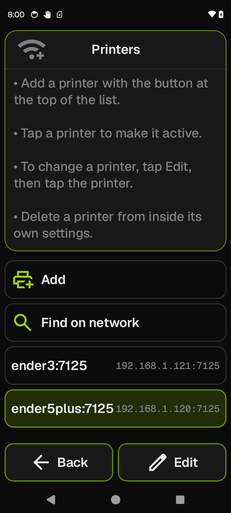

# Manage printers

Add, switch between, and manage printer profiles. Each profile stores the Moonraker address, optional API key, and a display name — one profile is active at a time.

**Getting there:** Home → System → **Manage printers**.

## The screen

The Focus card shows four static help bullets ("Add a printer…", "Tap a printer to make it active.", "To change a printer, tap Edit, then tap the printer.", "Delete a printer from inside its own settings."). They are always shown; there is no live state in the Focus here.

The list opens with two fixed action rows — **Add** and **Find on network** — followed by one row per saved profile. Each profile row shows the display name (or the host if no name is set) with the `host:port` address as a trailing label. The active profile's row is highlighted.

The foot bar holds **Back** and **Edit**.

## Options & controls

### Focus card

**Help text** — static instructions; four bullet points. Does not change with connection state or print state.

### List — fixed rows

- **Add** — opens the connection editor with all fields blank.
- **Find on network** — opens the network-scan screen (see [Find on network](#find-on-network) below).

### List — printer profile rows

Each row shows the profile's display name and `host:port`. Behavior depends on the current mode:

- **Normal mode** — tap a row to make that printer the active connection. The app connects immediately and returns to the previous screen.
- **Edit mode** — tap a row to open the connection editor for that profile.

### Foot bar

- **Back** (accent) — in Normal mode: returns to the System screen. In Edit mode: disarms Edit and returns to Normal mode.
- **Edit** (accent) — tap to arm Edit mode; the button fills with an accent tint while armed. Tap again to disarm. In Edit mode, profile row taps open the connection editor instead of switching the active printer.

---

## Find on network

The Find screen scans for Moonraker instances advertised on the local network via mDNS. A scan starts automatically when the screen opens.

**Focus card** — shows the current scan status:

- "Scanning…" while the 8-second scan window is open.
- "Connecting…" while probing a printer you tapped.
- "Tap a printer to add it." when results are ready.
- "No printers found — enter the host manually." when the scan completed with no results.

**List** — one row per discovered printer. Rows show the hostname from the mDNS advertisement (with any "moonraker @ " prefix stripped) and the IP address as a trailing label. When no distinct hostname is present, the IP alone is the label.

**Foot bar:**

- **Back** (accent) — returns to the Manage printers screen.
- **Scan** (accent) — starts a new scan; disabled and relabelled "Scanning…" while a scan is already running.

Tapping a discovered printer probes its HTTP and WebSocket endpoints with no API key. If both pass, the printer is saved and made active immediately — no further input required. The profile name is set to `hostname:port` from the mDNS advertisement, or `host:port` when no hostname was advertised. If either transport fails, the connection editor opens pre-filled with the discovered host and port so you can add an API key or adjust the address.

---

## Connection editor

The connection editor opens when you tap **Add**, when you tap a profile row in Edit mode, or when the Find screen hands off a printer that could not connect. It takes over the full screen in place of the profile list.

### Focus card

**At rest (no field selected)** — shows the derived WebSocket URL for the current host/port/Advanced settings, plus the result of the last Test run: pass/fail for HTTP and WebSocket separately, with a short failure reason when either fails. Shows "Not tested yet" before the first Test. Shows "Test" while a probe is in progress.

**Field selected** — shows an inline editor for the selected field, with a **Done** button (green).

The Focus card title reads "Add a printer" for new profiles or "Edit *name*" when editing an existing one.

### List rows

- **Name** — the profile's display name. Shown in row headers throughout the app; falls back to the host when blank.
- **Host** — the Moonraker host address or IP. Accepts bare hostnames, IP addresses, or `host:port` shorthand (scheme and port are extracted automatically). A `.local` mDNS name triggers a warning that the numeric IP is more reliable.
- **Port** — numeric; valid range 1–65535; defaults to 7125. Shows an inline error when the value is out of range.
- **API key** — only needed when your Moonraker config requires a trusted client or API-key auth. The raw stored key is never pre-filled; the trailing label reads "Set" if a key exists or "Not set" if not. Leaving the field blank on save preserves the stored key unchanged. When a key is already stored, a red **Clear key** button appears in the field editor — tap it to remove the stored key.
- **Advanced** — an optional full URL override for proxied or reverse-proxied Moonraker installs (e.g. `https://myprinter.example.com/moonraker`). Leave blank for a standard local install. Trailing label shows the value or "-" when not set.
- **Delete** _(existing profiles only)_ — red row; tapping opens a confirmation dialog ("Remove Printer? This will remove the connection profile. The printer itself is unaffected."). Confirm to delete; Back on the dialog cancels. Not shown when adding a new profile.

### Foot bar

- **Back** (accent) — if a field editor is open: closes the inline editor and returns to the field list. Otherwise: returns to the Manage printers screen without saving.
- **Test** (accent) — probes the HTTP and WebSocket endpoints for the current host/port/Advanced settings and shows the result in the Focus card. Disabled while a probe is already running or when the Host field is blank. Possible failure reasons: connection timeout, connection refused, unauthorized (API key or `trusted_clients` required), certificate error, or an unknown connection error.
- **Save** (green) / **Save anyway** (green) — validates host and port, then persists the profile. Relabels to **Save anyway** after a failed Test; the save still proceeds. Host and port must be valid for the profile to be persisted; if either fails validation, the error is shown but the profile is not saved. The button is always enabled.

---

## Hostname auto-naming

When you add a profile via **Add** without entering a name, jiib fetches the printer's hostname from Moonraker on the first connection and uses it as the profile name. This seed is applied only once; after that the name is locked and will not change on reconnect. Typing any name in the connection editor before saving also locks it and prevents auto-seeding.

> Uses `printer.info.hostname` from the Moonraker JSON-RPC handshake.

## Related

[System](system.md) · [Printer Settings](printer-settings.md)
