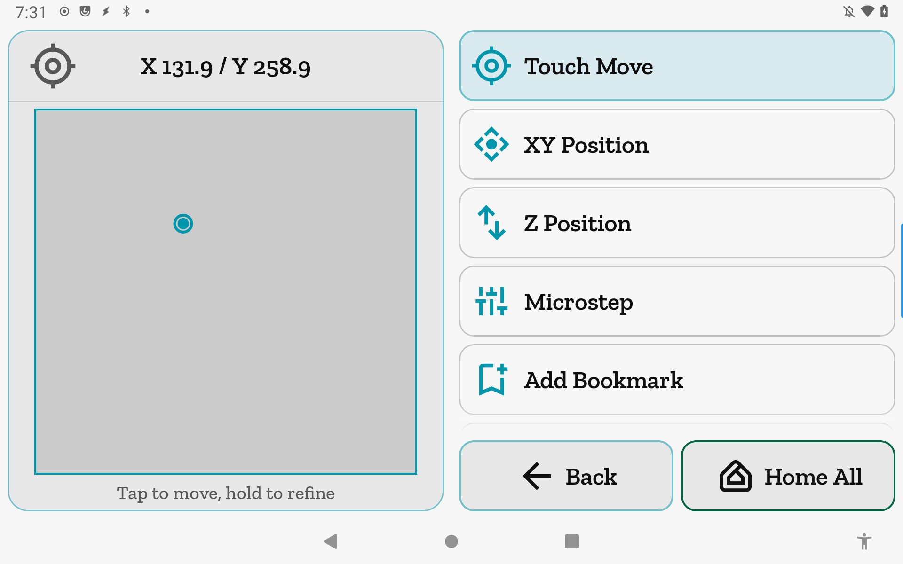
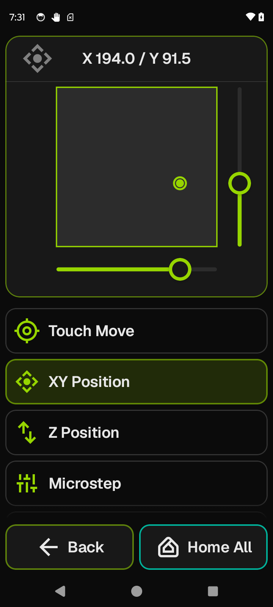
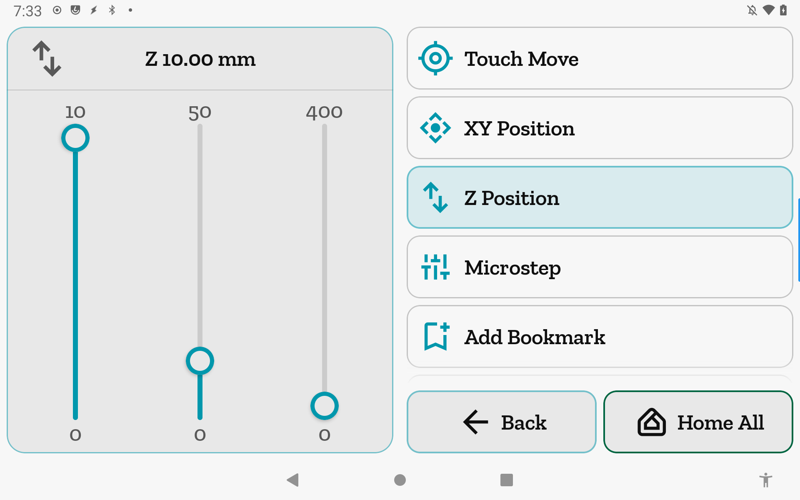
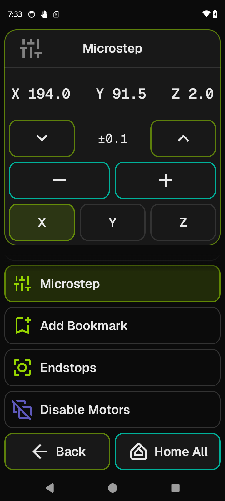
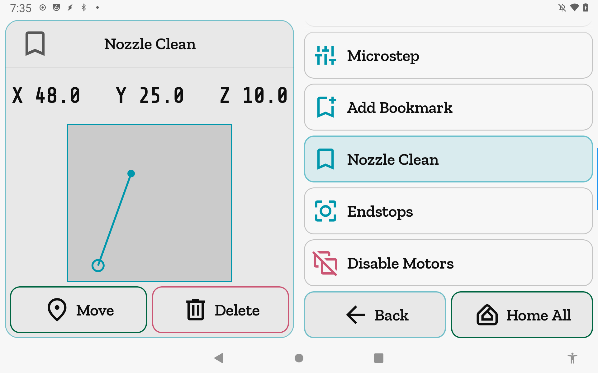
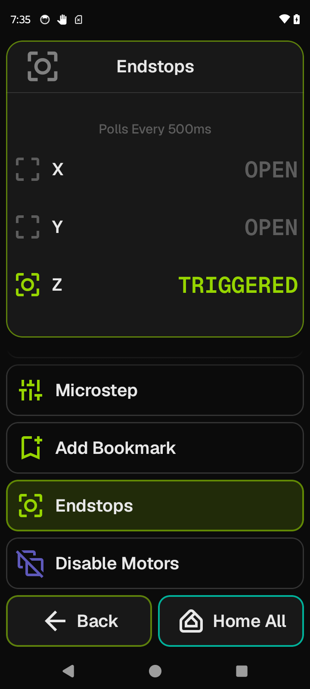

# Move

<table><tr>
<td valign="top"></td>
<td valign="top"></td>
</tr></table>

<table><tr>
<td valign="top"></td>
<td valign="top"></td>
</tr></table>

<table><tr>
<td valign="top"></td>
<td valign="top"></td>
</tr></table>

Move is a hub for positioning the toolhead. Pick a mode from the list — tap the bed map, scrub an axis, nudge by increment, or jump to a saved location bookmark.

**Getting there:** Home → Move (list row).

## The screen

The Focus card swaps its content and header title based on the selected mode. The header title tracks the active mode; in the coordinate modes (Touch Move, XY Position, Z Position) it shows the live target position instead of the mode name.

The list holds homing shortcuts (shown only when the relevant axes are not yet homed), the six mode selectors (each hidden until its homing precondition is met), a bookmark group (visible only when all axes are homed), the Endstops view row, and Disable Motors pinned at the bottom.

The foot bar holds **Back** and **Home All** throughout — **Home All** stays reachable from every sub-mode.

## Options & controls

### List rows

**Home XY** — visible only when X and Y are not both homed. Sends `G28 X Y`. A HardLock operation: the Focus card morphs to a "Homing" status card and all list rows dim and ignore taps until homing completes. The row disappears once both X and Y are homed.

**Home Z** — visible only when Z is not homed. Sends `G28 Z`. Same HardLock behavior. Disappears once Z is homed.

**Touch Move** — selects the Touch Move sub-mode. Visible only when all three axes (X, Y, Z) are homed.

**XY Position** — selects the XY Position sub-mode. Visible when both X and Y are homed.

**Z Position** — selects the Z Position sub-mode. Visible when Z is homed.

**Microstep** — selects the Microstep sub-mode. Visible when at least one axis is homed.

**Add Bookmark** — opens the Save Location form in the Focus card. Visible only when all three axes are homed.

**[Saved bookmark names]** — one row per saved location. Visible only when all three axes are homed. Tap a row to open that bookmark's detail in the Focus card. The entire bookmark group (Add Bookmark + all bookmark rows) collapses automatically if the printer un-homes.

**Endstops** — selects the live Endstops view. Always visible.

**Disable Motors** — sends `M84` immediately on tap with no confirmation dialog; un-homes the printer. The row icon renders in the danger color. Disabled (dimmed) while a homing operation is in progress. When motors are disabled, all homed-gated rows and modes collapse, and if the Focus card is showing a bookmark or the save form it resets to Touch Move automatically.

> Sends `M84`.

### Focus card — Touch Move mode

The Focus card shows a to-scale bed map. Tap anywhere on the map to stage a target position (the header coordinate updates immediately). Lift your finger to send the toolhead there. Drag to refine the target before lifting. A travel line on the map persists while the toolhead is moving to the committed target. A "Tap to move, hold to refine" caption is docked below the map.

The header title shows "X [value] / Y [value]" (one decimal place, mm): the staged target while your finger is down, or the live `gcode_position` when idle.

If bed bounds (`toolhead.axis_minimum` / `axis_maximum`) have not yet arrived from the printer, the Focus card shows "Waiting for printer bounds…" instead.

> Sends `SAVE_GCODE_STATE NAME=dd_moveto → G90 → G1 X… Y… F[feed] → RESTORE_GCODE_STATE NAME=dd_moveto`; rapid taps accumulate (SoftBusy).

### Focus card — XY Position mode

The Focus card shows the same bed map centered in the available area, with an X scrubber rail below the map and a Y scrubber rail to the right. Drag either rail to set a target; the map thumbnail updates as you drag. The move fires when you lift your finger (settle).

Scrubber ranges span the full bed extents from `toolhead.axis_minimum` / `axis_maximum`; step size is 1 mm; units are mm.

The header title shows "X [value] / Y [value]" tracking the scrubber positions.

If bed bounds are not yet known, the Focus card shows "Waiting for printer bounds…".

> Same `moveTo` gcode as Touch Move.

### Focus card — Z Position mode

The Focus card shows three vertical scrubbers side by side. Each controls the same Z axis at a different resolution:

| Column | Range | Step |
|--------|-------|------|
| Left   | 0 – 10 mm | 0.05 mm |
| Center | 0 – 50 mm | 0.1 mm  |
| Right  | 0 – max Z | 1.0 mm  |

The range maximum label is shown above each track; "0" below. All three scrubbers reflect the same working Z value — dragging any one updates the others and moves the toolhead on settle.

The header title shows "Z [value] mm" (two decimal places).

If Z bounds are not yet known, the Focus card shows "Waiting for printer bounds…".

> Sends `SAVE_GCODE_STATE NAME=dd_moveto → G90 → G1 Z… F[feed] → RESTORE_GCODE_STATE NAME=dd_moveto`; SoftBusy.

### Focus card — Microstep mode

The Focus card body shows the live XYZ coordinate readout centered (one decimal place each; "—" when a position is not yet reported). Three control rows are docked at the bottom:

**Step-size cycler** — a [−] / [current step] / [+] row. Each tap cycles through the printer's configured Microstep increments; the list wraps at both ends. Default values: 0.01, 0.025, 0.1, 0.25, 1.0, 2.5, 10.0 mm. You can replace this list in Printer Settings → [Increment Values](increments.md).

**Jog ±-pair** — [−] / [+] buttons. Each tap sends a relative move of ±(current step) on the selected axis. Disabled if the selected axis is not homed. Rapid taps queue rather than collapse (SoftBusy).

**Axis selector** — X / Y / Z tiles. Selects which axis the jog pair drives. A tile is disabled (greyed out) when that axis is not homed. On mode entry the selector defaults to the first homed axis.

If no axis is homed, the Focus card shows "Home an axis to micro-step" in place of the controls.

> Sends `SAVE_GCODE_STATE NAME=dd_jog → G91 → G1 [X|Y|Z][mm] F[feed] → RESTORE_GCODE_STATE NAME=dd_jog`; SoftBusy.

### Focus card — Bookmark detail

When you tap a saved bookmark row, the Focus card shows the bookmark's name in the header title. The body shows:

- **Coordinate readout** — the saved X / Y (and Z if stored) in large text at the top.
- **Bed map** — current toolhead position and the bookmark destination, with a travel line (drawn whenever the toolhead position is known).
- **Move** (green button) — sends the toolhead to the bookmark's X, Y, and Z. If Z was not saved with the bookmark, only X and Y are sent.
- **Delete** (red button) — asks for confirmation ("Delete [name]? / Remove this saved location."). Confirming removes the bookmark and returns the Focus card to Touch Move.

If the bookmark name is no longer in the saved-locations list at the time the Focus card renders, the Focus card shows "Bookmark not found" instead.

> Move sends the same `moveTo` gcode as Touch Move.

### Focus card — Save Location (Add Bookmark form)

**Name** — text field. The keyboard opens for name entry; this is one of the few places in the app where text input is the right tool. The Save button is disabled until the field is non-blank and the printer has reported X and Y positions.

**Include Z** — toggle. When on (default), the current Z position is stored with the bookmark. When off, only X and Y are stored (the toolhead will not move in Z when you later tap Move on this bookmark). The toggle label shows the current Z value. The toggle resets to on every time you open the form.

**Save** (green) — saves the location and returns to Touch Move. If a bookmark with the same name already exists, it is replaced.

**Cancel** (red) — discards the form and returns to Touch Move.

### Focus card — Endstops

Shows the live trigger state of every endstop configured in Klipper. Polls Moonraker's `printer.query_endstops.status` every 500 ms (the poll pauses while the app is backgrounded and resumes when it returns to the foreground).

A "Polls Every 500ms" note appears at the top of the list once the first response arrives. Each row shows: a state icon + the axis label (e.g. "X", "Y", "Z", "Z1", "Probe") + "OPEN" or "TRIGGERED". The icon and status-text color change to the accent color when triggered, and to muted when open. Endstops are listed in X, Y, Z order first, then alphabetically.

"Querying…" appears on first load before the first result arrives. "Endstops unavailable" appears if the poll throws a persistent error.

Endstop keys come from Klipper's `stepper_x` / `stepper_y` / `stepper_z` naming convention; the `stepper_` prefix is stripped for display.

### Foot bar

**Back** — leaves Move. If a HardLock homing operation is in progress (from Home All, Home XY, or Home Z), tapping Back asks for confirmation before navigating away.

**Home All** (green, always visible) — sends `G28`. HardLock: the Focus card morphs to a "Homing" status card and all list rows dim until complete. The same confirm-on-back guard applies.

### HardLock behavior during homing

While any homing operation is running (from the Home XY / Home Z list rows or the Home All foot button):

- The Focus body replaces its content with a centered "Homing" status card.
- All list rows dim to 38% opacity and ignore taps.
- The e-stop button remains active in the Focus header throughout.
- Tapping Back shows a confirmation prompt before leaving.

If the homing operation's completion cannot be confirmed (for example, the connection dropped mid-homing), the Focus card shows a "Still running" card with a manual **Dismiss** button to clear the unresolved state.

### Travel feedrate

All `moveTo` and `jog` commands use a feedrate derived from `toolhead.max_velocity` × 60 (converting mm/s to mm/min). If `max_velocity` has not yet been reported, the feedrate defaults to 6 000 mm/min. Coordinates reported by the app come from `gcode_position` (user-facing, offset-stripped), not the raw kinematic toolhead position.

## Related

[Concepts](concepts.md) — gating overlays, e-stop behavior, SoftBusy vs HardLock.
[Increment Values](increments.md) — editing the Microstep step list per printer.
[Fine-Tune](fine-tune.md) — live speed/flow/PA adjustment during a print.
