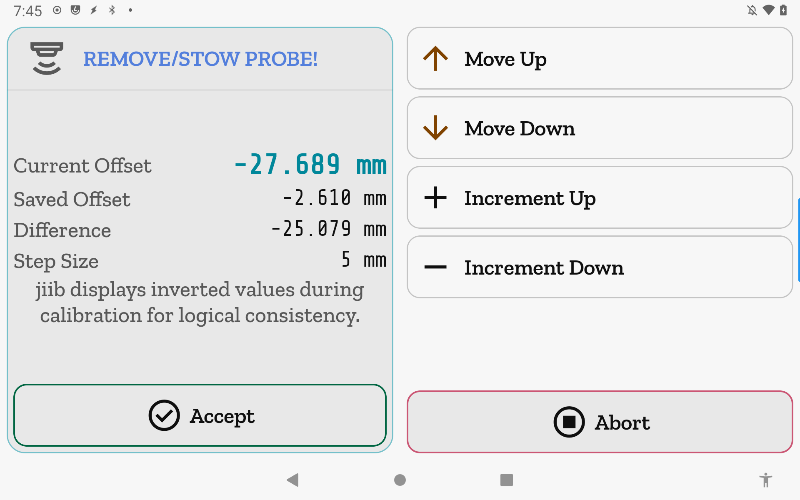
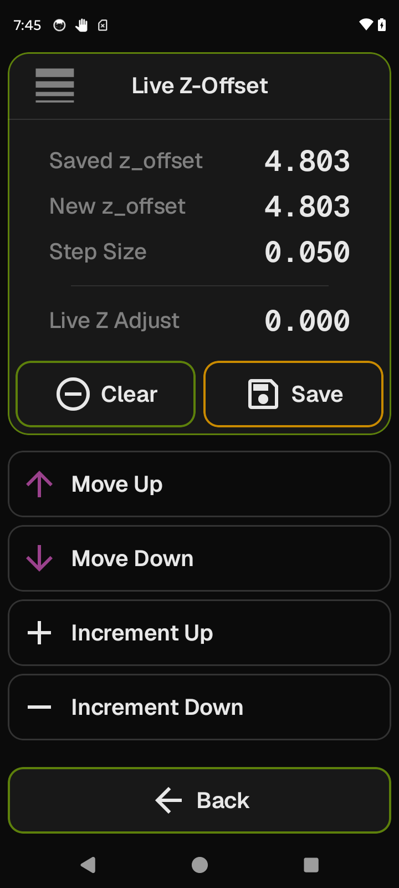

# Nozzle Distance

Six tools in one place: probe Z-offset calibration, probe testing, live first-layer babystepping, and three eddy-current probe calibration steps.

**Getting there:** Home → Calibration → Nozzle Distance.

## The screen

The **Focus card** shows the selected tool's name, icon, and live state. The **list** below holds the tools your printer supports, with supported tools sorted first. Tools your printer does not support are hidden by default; turn on **Show unsupported tools** in App Settings to see them greyed out.

Tapping a tool loads its content into the Focus card. While a calibration session is running, all list rows dim and stop responding to taps until the session ends.

The **foot bar** normally holds **Back** (accent, first). During an active Z-offset calibration session **Abort** (red) replaces Back. During all other active sessions — eddy calibration, or the brief "Starting…" window before a Z-offset session opens — the foot bar is empty and Back is suppressed.

## Options & controls

### List

- **Probe Calibrate** — The interactive Z-offset calibration tool. Trailing value: saved `z_offset` (sign-inverted; see note below). Requires the `manual_probe` Klipper object.
- **Probe Test** — Query the probe switch state, run a single probe cycle, or measure probe repeatability over multiple samples. Requires the `probe` object.
- **Live Z-Offset** — Baby-step the live Z offset in real time and optionally bake the result into the config. Trailing value: the computed new `z_offset` if applied. Requires the `gcode_move` object.
- **Eddy: Calibrate** — Paper-test position then resonance sweep for eddy-current probes. Requires a `probe_eddy_current` object.
- **Eddy: Tap Threshold** — Set the eddy-current tap detection threshold. Requires a `probe_eddy_current` object.
- **Eddy: Drive Current** — Calibrate the coil drive current for optimal signal amplitude. Requires a `probe_eddy_current` object.

### Focus card — Probe Calibrate

Three states driven by the `manual_probe.is_active` session flag:

**Idle** — Shows the saved `z_offset` as a large hero value (sign-inverted; see note below) plus the instruction blurb "Home all axes, then tap Start to begin Z-offset calibration." The dock button adapts to readiness:
- Not all of X, Y, Z homed → **Home All** (green). Sends `G28`.
- All axes homed → **Start** (green). Sends `PROBE_CALIBRATE` on a probe-equipped printer, or `Z_ENDSTOP_CALIBRATE` on a probe-less printer; the correct command is chosen automatically from Klipper capabilities.
- Command in flight, session not yet open → **Starting…** (disabled, dimmed).

**Active** — The Focus header title changes to **REMOVE/STOW PROBE!** in amber as a reminder to stow a removable probe before jogging. Four readout rows appear in the Focus body: **Current Offset**, **Saved Offset**, and **Difference** (all sign-inverted; see note below) plus **Step Size** (mm, positive jog magnitude — not inverted). The dock shows **Accept** (green). The foot bar shows **Abort** (red) in place of Back.

At the same time, the list swaps to four jog rows: **Move Up**, **Move Down**, **Increment Up**, **Increment Down**. Move Up/Down send `TESTZ Z=±step`; the increment rows cycle through the configured step sizes. Move Up and Move Down disable and dim while a nudge is already in flight; Increment Up and Increment Down disable only when already at the end of the step list.

> Jog step sizes come from the **Probe Z Test** list in **Printer Settings → Increment Values** (`probe_testz` key; defaults: 0.005, 0.01, 0.025, 0.05, 0.1, 0.25, 0.5, 1.0, 5.0, 10.0 mm). Each nudge is clamped to ±25 mm.

**Accepted** — The session ended via Accept. Shows the captured delta (new offset minus saved). The dock shows **Reboot to Save** (amber). Tapping raises a confirmation dialog; confirmed, it sends `SAVE_CONFIG`, persisting the new offset and restarting Klipper.

**Abort** (foot bar, Active only) — Abandons the session with no change and returns to Idle. Sends `ABORT`.

**Inverted values** — All values in the Probe Calibrate tool are negated from Klipper's internal representation, so a stored `z_offset` of −1.230 is displayed as 1.230. The caption "jiib displays inverted values during calibration for logical consistency" appears in the Idle and Active states. This inversion applies only to Probe Calibrate, not to Live Z-Offset.

### Focus card — Probe Test

**Last Z** — The most recent probed Z height from `probe.last_z_result` (`±x.xxxx mm`; "—" until a probe cycle completes in this session).

**Accuracy block** — After a completed `PROBE_ACCURACY` run: Range, Std Dev, Average, Median, Min, Max (4 dp mm, displayed in two columns). "—" until a run completes.

**Live probe-switch dot** (Focus header trailing indicator) — Always present while Probe Test is selected. Red = TRIGGERED; accent color = OPEN; dimmed = probe is not wired as the Z virtual endstop, no data yet, or poll is suspended. Polled every 500 ms via `QUERY_ENDSTOPS`; polling suspends while printing or paused to avoid flushing Klipper's motion lookahead.

Dock controls:

- **−** and **+** (accent) — Decrease or increase the sample count for `PROBE_ACCURACY`. Disable at the list ends.
- **Samples** (center read-only cell) — Displays the current count. Options: 1, 2, 3, 5, 10, 20, 30, 50; default 10.
- **Probe** (green) — Runs one probe cycle. Sends `PROBE`.
- **Accuracy** (green) — Runs `PROBE_ACCURACY SAMPLES=n` with the selected count.

### Focus card — Live Z-Offset

Three readout rows: **Saved z_offset** (the current saved value from config), **New z_offset** (what the saved offset would become if you apply — equals saved minus live babystep), **Live Z Adjust** (the running `gcode_move.homing_origin[2]` offset). The list row's trailing value mirrors **New z_offset**.

**Idle** — Dock: **Adjust** (green). Tapping enters adjust mode.

**Adjust mode** — A **Step Size** row is added to the readout block. The list swaps to babystep jog rows (same four-row layout as Probe Calibrate's jog field; step sizes are fixed at 0.02, 0.05, 0.10, 0.15, 0.20 mm). Back (foot bar) or the system Back gesture collapses adjust mode without applying anything.

Dock in adjust mode:

- **Clear** (accent) — Zeroes the live babystep immediately. Disabled when the live babystep is already zero.
- **Save** (amber) — Bakes the babystep into the saved `z_offset` and persists it to config. A confirmation dialog appears first. Disabled during a print, or when there is nothing to apply.

> **Clear** sends `SET_GCODE_OFFSET Z=0 MOVE=1`. **Save** sends `Z_OFFSET_APPLY_PROBE` followed immediately by `SAVE_CONFIG` as a single ordered gcode block, or `Z_OFFSET_APPLY_ENDSTOP` + `SAVE_CONFIG` on a probe-less printer. The two commands are never dispatched separately to prevent a reorder race that would persist the stale offset.

### Focus card — Eddy: Drive Current

Shows a one-line tool description and an amber build-blind caution (this tool requires eddy-current hardware and cannot be validated without it). A scrolling console tail fills the center of the Focus card, showing up to the last 200 lines of gcode output from the current run. The console clears each time you switch to any eddy tool.

- **Run** (green) — Starts a drive-current calibration pass. Sends `LDC_CALIBRATE_DRIVE_CURRENT [CHIP=<name>]`.
- **Save & Restart** (amber) — Sends `SAVE_CONFIG` after a confirmation dialog.

### Focus card — Eddy: Tap Threshold

Same layout as Eddy: Drive Current, with a **stage selector** row added below the console: three chips — **Guess**, **Refine**, **Verify**. The highlighted chip is the active stage. Tap any chip to change stages; the selection persists while you stay on this tool.

- **Run** (green) — Sends `PROBE_EDDY_CURRENT_TAP_CALIBRATE TAP=<stage>` where stage is `guess`, `refine`, or `verify`.
- **Save & Restart** (amber) — Sends `SAVE_CONFIG` after a confirmation dialog.

### Focus card — Eddy: Calibrate

Three phases:

**Idle** — Tool description and amber build-blind caution. Dock: **Start** (green) / **Starting…** (disabled, dimmed, while the command is in flight and the `manual_probe` session has not yet opened). Sends `PROBE_EDDY_CURRENT_CALIBRATE [CHIP=<name>]`.

**Active** (paper test) — A Z distance hero fills the top of the Focus body; a two-column jog widget (Move Up/Down with live Z readout in the center cell, plus step selector column) fills the space below it. Accept and Abort appear side-by-side in the Focus dock. The foot bar is empty; Back is suppressed. Jog nudges send `TESTZ Z=±step`.

**Accepted** (resonance sweep) — Klipper runs the resonance sweep automatically after Accept. A caption ("Resonance sweep in progress — this may take several minutes. Watch the console for completion.") appears above a console tail showing the sweep output; pre-sweep paper-test noise is cleared on the Active→Accepted transition so only sweep lines appear. Dock: **Save & Restart** (amber); sends `SAVE_CONFIG` after confirmation.

## Related

[Concepts](concepts.md) — gating overlays, e-stop behavior, and the printing-state lock.
[Calibration](calibration.md) — the calibration hub that leads to this screen.
[Increment Values](increments.md) — edit the Probe Z Test step list used during calibration.
