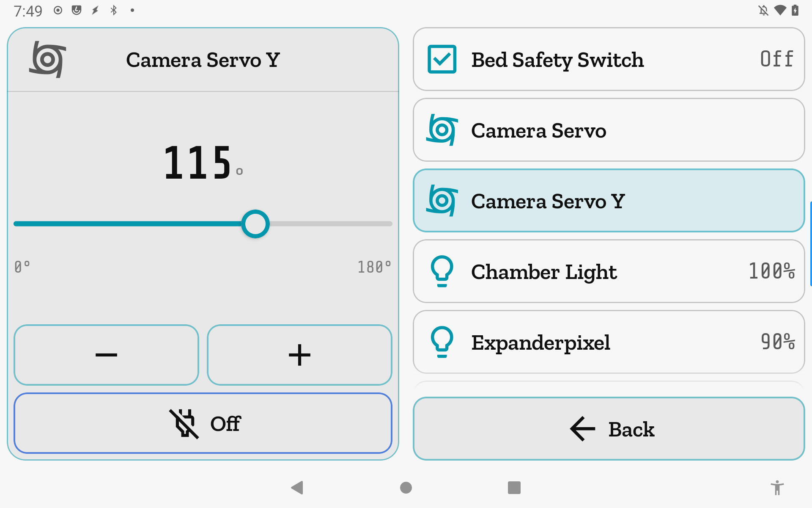
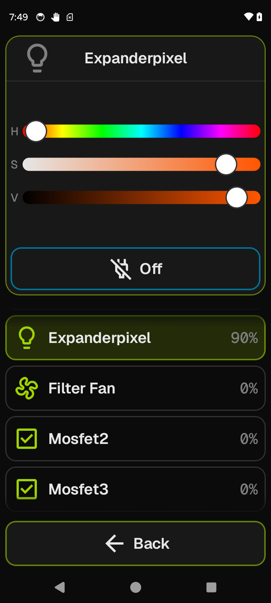

# Outputs

Control every hardware output Klipper exposes — fans, servos, heaters, addressable LEDs, and generic
pins — from a single screen. Tap a row to load its control surface into the Focus card.

**Getting there:** Home → Outputs. The Outputs row is hidden from the Home list when the connected
printer exposes no controllable outputs.

## The screen

The **Focus card** opens with a "Select an output" prompt. Tapping any list row loads that output's
inline control surface into the Focus card (the title and icon update to match). No navigation push
occurs — switching outputs is instant and stays on the same screen.

The **list** contains every output jiib discovered in `configfile.settings`, filtered to the ten
controllable families and cross-checked against `objects.list`. Rows are sorted alphabetically by
display name. Each row shows a family icon, the output's display name, and a live value badge where
one is available (see list row details below). Tapping the currently selected row has no effect;
tap any other row to switch.

The **foot bar** has one button: **Back** (accent).

## Options & controls

### List rows

Each row shows the output's family icon, display name, and — where the live state is readable — a
trailing value badge:

- **fan_generic rows** — trailing badge shows current speed as a percentage (e.g., `45%`).
- **output_pin (PWM) and pwm_tool rows** — trailing badge shows current value as a percentage.
- **output_pin (digital) rows** — trailing badge shows `On` or `Off`.
- **heater_generic rows** — trailing badge shows the current measured temperature in °C (e.g., `210°C`). This is the live temperature, not the target.
- **LED family rows** — trailing badge shows the brightness of the brightest channel as a percentage.
- **servo rows** — no trailing badge. The live `.value` field Klipper reports is a PWM duty cycle, not an angle, so jiib cannot display a meaningful angle readout.

### Focus card — fan_generic

A 004 ringed-thumb scrubber spanning **0–100%** in 1% steps. Drag or use the **−** / **+** stepper
buttons to adjust; the command fires when you release the scrubber or tap a stepper.

The dock holds the **Off** button (amber), which sets speed to 0%.

> Sends `SET_FAN_SPEED FAN=<name> SPEED=<0..1>`; requires `[fan_generic <name>]` in your Klipper config.

### Focus card — pwm_tool

A 004 ringed-thumb scrubber spanning **0–100%** in 1% steps, with **−** / **+** steppers and an
**Off** button (amber, sets to 0%).

> Sends `SET_PIN PIN=<name> VALUE=<0..1>`; requires `[pwm_tool <name>]` in your Klipper config.

### Focus card — servo

A 004 ringed-thumb scrubber spanning **0°** to the servo's `maximum_servo_angle` (default 180°) in
**5° steps**, with **−** / **+** steppers. The scrubber always starts at 0° — Klipper's `.value`
field for a servo reports a PWM duty, not the commanded angle, so the current position cannot be
read back.

The **Off** button (amber) disables the servo rather than commanding an angle.

> Positions: sends `SET_SERVO SERVO=<name> ANGLE=<deg>`; requires `[servo <name>]` in your Klipper config.
> Off: sends `SET_SERVO SERVO=<name> WIDTH=0`.

### Focus card — heater_generic

A 004 ringed-thumb scrubber spanning **0–350°C** in 5°C steps, with **−** / **+** steppers. The
Off button (amber) sets the target to 0°C.

> Sends `SET_HEATER_TEMPERATURE HEATER=<name> TARGET=<deg>`; requires `[heater_generic <name>]` in your Klipper config.

### Focus card — output_pin (digital)

A large **On** / **Off** readout fills the Focus body, color-coded: On is green, Off is dim. Two
foot buttons dispatch immediately — **On** (green) and **Off** (amber). No confirmation step.

A digital pin configured with `static_value` in Klipper is **read-only**: the state readout is
shown with a "Read-only output" caption, and no foot buttons appear.

> On: sends `SET_PIN PIN=<name> VALUE=1`. Off: sends `SET_PIN PIN=<name> VALUE=0`.
> Requires `[output_pin <name>]` with `pwm: False` in your Klipper config.

### Focus card — output_pin (PWM)

A 004 ringed-thumb scrubber spanning **0–100%** in 1% steps, with **−** / **+** steppers and an
**Off** button (amber, sets to 0%).

> Sends `SET_PIN PIN=<name> VALUE=<0..1>`; requires `[output_pin <name>]` with `pwm: True` in your Klipper config.

### Focus card — LED families (led, neopixel, dotstar, pca9533, pca9632)

The control surface adapts to what the LED strip actually supports, detected from your Klipper config:

**RGB or RGBW strips** — three H/S/V sliders let you set hue, saturation, and brightness. An
independent **White** slider appears below the color sliders when the strip has a dedicated white
channel (RGBW). Adjusting any slider sends the complete color state on release so no channel is
accidentally zeroed.

**White-only strips** — a single brightness scrubber (0–100%, step 1%) with **−** / **+** steppers.
The White channel is set directly; RGB channels are sent as zero.

The Focus card is seeded from the strip's live color data each time you select it, so the sliders open
at the current color rather than a default.

The **Off** button (amber) zeroes all channels.

> Sends `SET_LED LED=<name> RED=<0..1> GREEN=<0..1> BLUE=<0..1> [WHITE=<0..1>]`.
> Channel capability (RGB/white) is read from `configfile.settings` at connect time; no extra config step required beyond your existing LED section.

### Busy lock and failure handling

While a command to an output is in-flight, that output's Focus controls are disabled. The lock
clears automatically once Moonraker confirms the new value, or after an 8-second timeout (used for
servos, whose live value cannot confirm an angle change). A dispatch failure surfaces as an error
toast for 4 seconds and releases the lock immediately.

## Related

[Heaters](heaters.md) — for `extruder`, `heater_bed`, and temperature fans (those are not
Outputs). [Temperature](temperature.md) — live temperature graphs and monitoring mode.
[Concepts](concepts.md) — gating overlays, the e-stop button, and busy-lock behavior.
