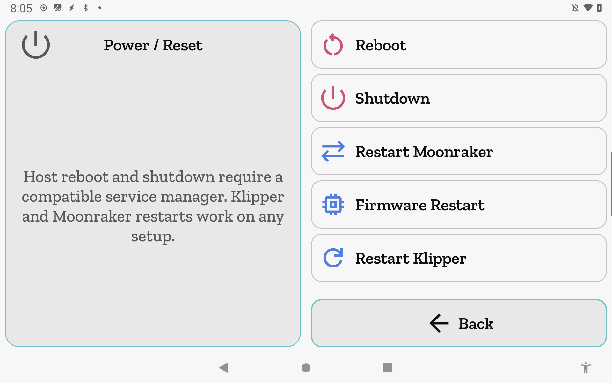

# Power / Reset

Send host power commands and service restarts to the printer — reboot, shutdown, or restart Moonraker, the Klipper firmware, or the Klipper process.

**Getting there:** Home → System → Printer Settings → Power / Reset.

## The screen

The Focus card shows the screen title and a note that host reboot and shutdown require a compatible service manager; Klipper and Moonraker restarts work on any setup. The list holds five command rows in a fixed order: Reboot, Shutdown, Restart Moonraker, Firmware Restart, Restart Klipper. The foot bar has a single **Back** button (accent intent).

The e-stop is available in the Focus header while printing, consistent with the app-wide [FocusFrame](concepts.md) behavior.

## Options & controls

### Command rows

Tap an enabled row to open a confirmation dialog. The dialog shows a title and a brief description of what will happen; tap **Confirm** to send the command, or tap **Cancel** to dismiss without acting. While a command is in-flight (sent but not yet acknowledged), the row is disabled until it completes.

**Reboot** — reboots the printer's host computer. The Moonraker connection drops while the host restarts; jiib reconnects automatically when it comes back. Disabled when the host's service manager doesn't support rebooting the hardware (see service-manager gating below). Icon and label are tinted red. Sends `machine.reboot` to Moonraker.

**Shutdown** — powers off the printer's host computer. The connection drops and won't return until the host is physically powered back on. Disabled under the same conditions as Reboot. Icon and label are tinted red. Sends `machine.shutdown` to Moonraker.

**Restart Moonraker** — restarts the Moonraker service on the host. The connection drops briefly and reconnects on its own. Disabled when Moonraker isn't a managed service on this host (see service-manager gating below). Icon and label are tinted amber. Sends `machine.services.restart` with `service="moonraker"`.

**Firmware Restart** — restarts the Klipper firmware on every MCU connected to this printer. All boards restart; the printer is unavailable for a few seconds while they reconnect. Never capability-gated. Icon and label are tinted amber. Sends `printer.firmware_restart` to Moonraker.

**Restart Klipper** — soft-restarts the Klipper process. The printer is briefly unavailable; any active print is lost. Never capability-gated. Icon and label are tinted amber. Sends `printer.restart` to Moonraker.

### Service-manager gating

Jiib reads the `provider` field from `machine.system_info` after connecting to decide which host rows are available.

**Reboot and Shutdown** are enabled for `systemd_dbus` and `systemd_cli` providers. They are disabled for `none`, `supervisord`, `supervisord_cli`, or any provider whose name starts with `supervisord`; a muted caption below the row label reads "This host's service manager can't reboot/power it off." Any other provider value (unknown or null) is left enabled by default — if the host truly can't do it, Moonraker will reject the command.

**Restart Moonraker** is disabled when the provider is `none`, or when the `available_services` list is non-empty and omits `"moonraker"`; a muted caption reads "Moonraker isn't a managed service on this host." An empty or absent `available_services` list keeps the row enabled.

Before system info has been fetched (no handshake data yet), all rows default to enabled.

### Confirmation dialogs

Every row requires a confirmation tap before anything is dispatched. The **Confirm** button is styled red for Reboot and Shutdown, and amber for the three restart commands.

## Related

[Printer Settings](printer-settings.md) · [System & settings](system.md)
