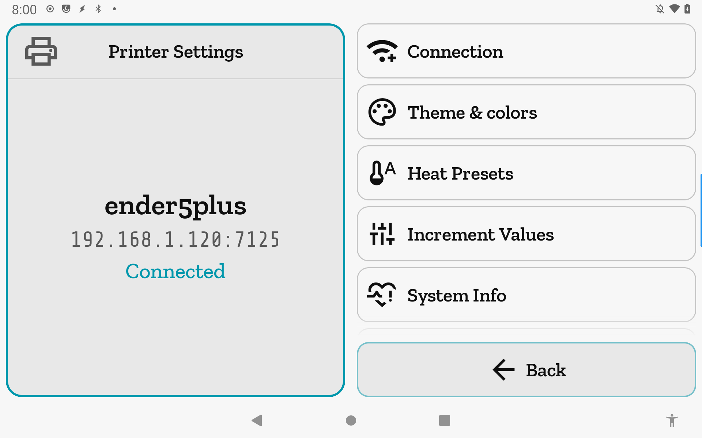

# Printer Settings

Per-printer configuration hub for the active printer.

**Getting there:** Home → System → Printer Settings.

## The screen

The Focus card identifies the printer you're editing: its display name, host and port, and a
connection-state label beneath them. A color ring frames the Focus edge when the state is
notable — accent for Connected, amber for Connecting or Syncing, red for Error, no ring
when Disconnected.

Below the Focus card, six navigation rows open each per-printer setting area. The foot bar has a
single Back button.

**Empty state.** When no printer profile exists, the Focus card shows "No printers configured"
with the message "Tap Add to set up your first printer." The list collapses to a single Add
row; all six setting rows are hidden until a profile is present.

## Options & controls

### Focus card

- **Display name** — the profile's name; falls back to the host address if the profile has
  no name set. Centered in the Focus card.
- **Host : port** — the configured Moonraker address (e.g. `192.168.1.120:7125`). Centered
  below the display name.
- **Connection state** — one of Connected, Connecting…, Syncing…, Error, or Disconnected.
  Shown in the ring color when a ring is active, or in the secondary text color when
  Disconnected.

### List rows

All six rows are hidden in the empty state (no active profile).

- **Connection** — opens the connection editor in place of this screen. Edit the name,
  host, port, API key, and advanced URL for the active printer. Back returns here without a
  full navigation pop.
- **Theme & colors** — opens the per-printer theme screen. Each printer can carry its own
  dark/light mode, palette mode, seed-color hue, and individual color overrides — useful at
  a glance when you run more than one printer.
- **Heat Presets** — opens the preheat preset editor for this printer. Add, delete, and
  name presets with nozzle and bed temperature targets; presets appear on the Heaters screen.
- **Increment Values** — opens the per-printer step-size editor. Step values for every
  adjustment control (move distance, speed, flow rate, pressure advance, smooth time, fan,
  machine limits) are comma-separated lists you define here.
- **System Info** — opens a read-only browser of the host board (architecture, cores, RAM,
  OS, CPU load, temperature) and every MCU Klipper talks to (firmware version, load).
- **Power / Reset** — opens restart and shutdown controls: Firmware Restart, Restart
  Klipper, Restart Moonraker, and (when supported by the host service manager) Reboot and
  Shutdown. Destructive actions confirm before firing.

### Empty-state list

- **Add** — visible only when no printer is configured. Opens the connection editor to set
  up the first printer profile.

### Foot bar

- **Back** (accent) — returns to the System screen.

## Related

[Concepts](concepts.md) · [Connection Editor](connection.md) ·
[Theme & colors](theme.md) · [Heat Presets](heat-presets.md) ·
[Increment Values](increments.md) · [System Info](system-info.md) ·
[Power / Reset](power-reset.md)
