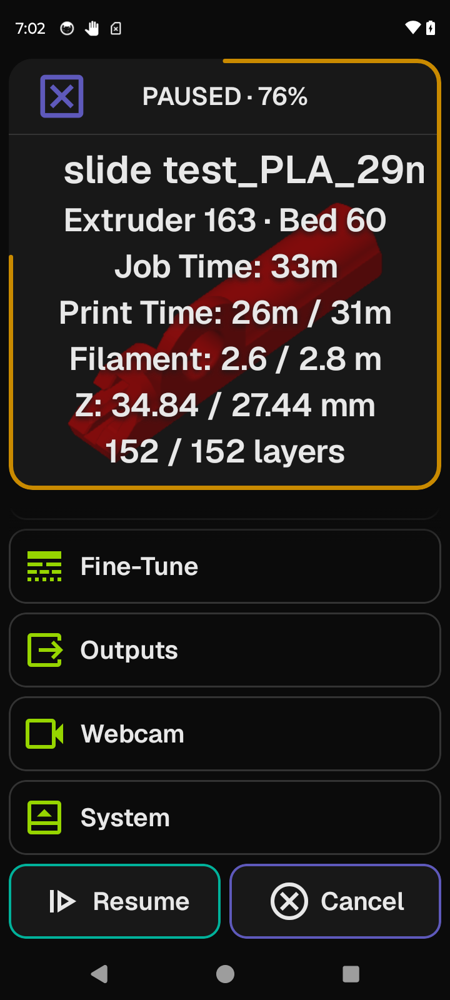
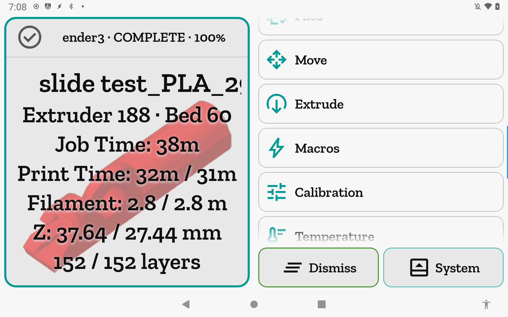
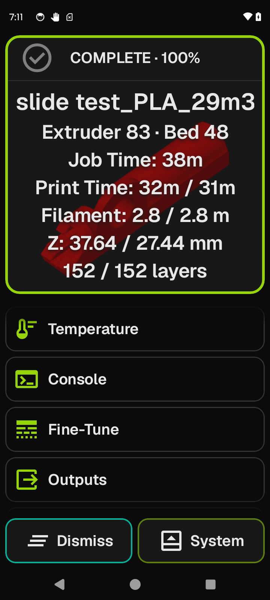

# Printing, Paused & Complete

The home screen morphs into a print dashboard when a job is running or just finished: live progress, a stat block over the gcode thumbnail, and job controls in the foot bar. All tool screens remain reachable from the list.

**Getting there:** The home screen enters this state automatically when a print is active. To start a print: Home → Files, select a file, tap **Print**.

## The screen

### Printing

The **Focus card** header reads `PRINTING · NN%` (for example `PRINTING · 42%`). When more than one printer profile is saved, the active printer's name is prepended: `Ender 5 · PRINTING · 42%`. A clockwise accent-colored ring runs around the card edge, tracking job progress in real time.

The card background fills with the gcode thumbnail (fetched once per filename from Moonraker). A 50% scrim sits between the thumbnail and the centered data block. When no thumbnail is available, the app icon watermark fills the background instead.

The **data block** is centered over the thumbnail:

- **Filename** — the file's basename (headline line).
- **Heaters** — every configured heater's current temperature, rounded to the nearest degree, dot-joined: `Extruder 230 · Bed 75`. Labels drop the `heater_generic ` and `heater_` Klipper object-name prefixes and capitalize the remainder. Cold heaters are still shown — an extruder at 20° appears here.
- **Job Time** — total elapsed time since the print started: `1h05m`, `45m`, or `30s`.
- **Print Time** — elapsed active print time versus the slicer's estimated total: `5m / 45m`. Shown as elapsed alone when the gcode file carries no time estimate.
- **Filament** — extrusion used versus slicer total, in meters to one decimal: `5.2 / 12.3 m`. Used alone when the gcode file carries no filament total.
- **Z** — current toolhead Z versus model height, both to two decimals: `1.20 / 55.00 mm`. Shows as `—` when Z position is not available.
- **Layers** — current layer over total: `5 / 220 layers`. Omitted when either value is unavailable (some slicers do not write layer count).

The **E-stop** button (danger) is docked in the Focus card header and remains reachable at all times while printing. See [Concepts](concepts.md).

The **list** shows all tool rows (Files, Move, Extrude, Macros, Calibration, Temperature, Console, Fine-Tune, and — when configured — Spool, Outputs, and Webcam). The **System** row is appended at the bottom of the list while printing or paused, because the foot bar is occupied by print controls.

The **foot bar** holds **Pause** (amber) and **Cancel** (red).

---

### Paused

When the print is paused — whether by tapping **Pause** or from a filament-runout sensor — the header changes to `PAUSED · NN%` and the progress ring turns amber. The data block and list are unchanged. The E-stop remains in the header.

The **foot bar** holds **Resume** (green) and **Cancel** (red).

---

### Complete

When the job finishes, the header reads `COMPLETE · 100%`, the ring pins at full accent, and the header icon changes to a check circle. The data block freezes with the final stats; the thumbnail remains. The E-stop is not shown — the printer is idle and Klipper is healthy.

The **list** returns to the standard tool list; System is back in the foot bar.

The **foot bar** holds **Dismiss** (green) and **System** (accent).

## Options & controls

### Focus card

**State title** — `[PrinterName · ]PRINTING · NN%`, `[PrinterName · ]PAUSED · NN%`, or `[PrinterName · ]COMPLETE · 100%`. The printer name prefix is shown only when more than one printer profile is saved.

**Progress ring** — clockwise perimeter stroke tracking `virtual_sdcard.progress` (falling back to `display_status.progress`). Accent color while printing; amber while paused; full accent pinned at 100% on completion.

**E-stop** (danger, header) — visible while printing or paused; absent on completion. See [Concepts](concepts.md).

### Data block fields

**Filename** — the basename of the printing file (directory path stripped, extension retained). Displayed as the headline above the stat lines.

**Heaters** — current temperature (integer, no decimal) of every configured heater, in canonical order (`extruder` first, then `heater_bed`, then remaining heaters sorted by name). All heaters are shown regardless of whether they are active or cold. Omitted only when the printer reports no heaters.

**Job Time** — `total_duration` from `print_stats`, formatted as `XhYYm` (hours + zero-padded minutes), `Xm` (minutes), or `Xs` (seconds). Always present while a filename is active.

**Print Time** — `print_duration` from `print_stats`. Paired with the slicer's estimated time from file metadata as `elapsed / estimate`; shown as elapsed alone when the estimate is missing or zero.

**Filament** — `print_stats.filament_used` (in mm internally, displayed in meters to one decimal). Paired with `filament_total` from file metadata as `used / total m`; shown as used alone when the total is missing.

**Z** — `gcode_position[2]` (the current Z coordinate) paired with `object_height` from file metadata as `current / total mm` to two decimals; shown as `current mm` when model height is missing; `—` when the current Z is unavailable.

**Layers** — current layer paired with total layer count as `current / total layers`. Current layer comes from `print_stats.info.current_layer` when the slicer writes it; otherwise derived from the current Z and the slicer's `first_layer_height` / `layer_height` metadata. Omitted when either bound is missing or zero.

> Thumbnail and slicer stats (estimated time, filament total, model height, layer count) are fetched once via `server.files.metadata` the moment the filename becomes active. They persist through the Complete state and clear only when the printer returns to standby.

### List

All rows function normally during any print state — tapping a row navigates to that tool screen.

**System row** — shown at the bottom of the list during Printing and Paused states. Navigates to the System hub. Not present during Complete (System is in the foot bar instead).

**Dispatch error toast** — a red error banner appears above the foot bar for four seconds when a print command fails (for example, when the connection drops mid-pause). Dismissed automatically; no action required.

### Foot bar — Printing

**Pause** (amber) — sends a pause request. The printer finishes its current move before pausing.

> Calls Moonraker JSON-RPC `printer.print.pause`; requires `[pause_resume]` in your Klipper config.

**Cancel** (red) — opens the cancel confirmation dialog before sending anything.

> On confirm, calls `printer.print.cancel`; requires `[pause_resume]` in your Klipper config.

#### Cancel confirmation dialog

"Cancel print?" / "This stops the current job. The printer will not finish this print."

- **Cancel print** (red, destructive) — confirms and aborts the job.
- **Cancel** (accent) — dismisses without aborting.

The dialog opens as a full-screen overlay so it remains accessible regardless of list scroll position.

### Foot bar — Paused

**Resume** (green) — resumes the paused print.

> Calls `printer.print.resume`; requires `[pause_resume]` in your Klipper config.

**Cancel** (red) — same cancel confirmation dialog as above.

### Foot bar — Complete

**Dismiss** (green) — clears the finished job and returns the home screen to standby.

> Sends the gcode `SDCARD_RESET_FILE`; requires `[virtual_sdcard]` in your Klipper config (standard on all Klipper setups).

**System** (accent) — navigates to the System hub.

## Related

[Concepts](concepts.md) — e-stop, gating overlays, and connection states explained app-wide.  
[Files](files.md) — browse gcode files and start a print.  
[Fine-Tune](fine-tune.md) — adjust speed, flow, and pressure advance while a print is running.  
[Heaters](heaters.md) — preheat before starting a print.
