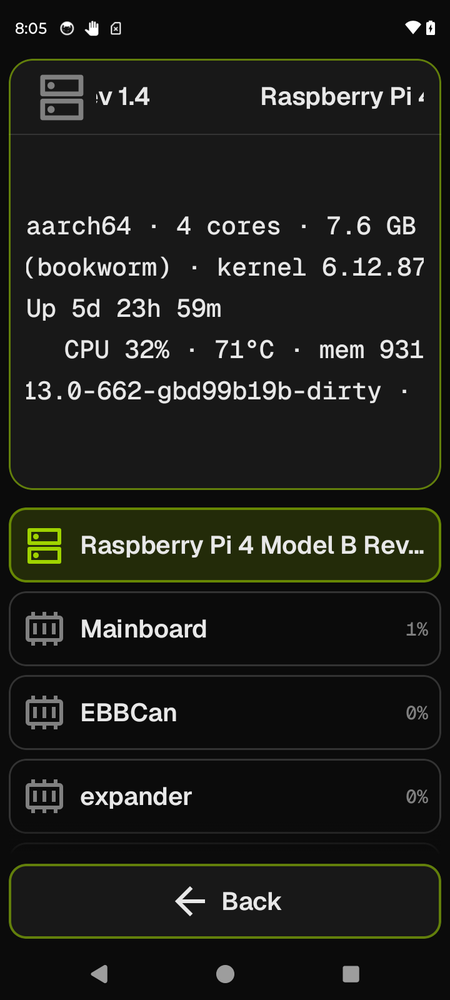

# System Info

A read-only browser of the hardware behind the printer: the host SBC and every MCU Klipper
talks to, with static identity and live resource stats.

**Getting there:** Home → System → Printer Settings → System Info.

## The screen

The Focus card shows the detail of whichever device is selected in the list. The title and
icon in the Focus header update to match: a host icon for the SBC, an MCU icon for each
board. The detail body is a scrolling plain-text digest — all the fields described below,
each on its own line, with "—" wherever data hasn't arrived yet or the host doesn't expose
it.

The list (Field) contains the host entry first, then each MCU Klipper has configured, in
stable order (the primary `mcu` first, then the rest alphabetically). Each row shows the
device name on the left and a live glance stat on the right — CPU load percentage for the
host, MCU awake percentage for each board. Tap any row to load its detail into the Focus card.

The host entry is selected by default on arrival. MCU rows appear once the screen's load
sequence completes; on a slow first open the list may briefly show only the host row while
capabilities settle.

The foot bar has a single **Back** button.

## Options & controls

### List rows

- **Host row** — always present; shows the host SBC name (the machine's hardware model string,
  or the OS distro name if the hardware model is blank, or "Host" if neither is available).
  The right-side glance stat is the live CPU load percentage, updated at roughly 1 Hz from
  Moonraker's `notify_proc_stat_update` push. Tap to select.
- **MCU rows** — one per Klipper MCU object (`mcu`, `mcu host`, `mcu <name>`). The primary
  `mcu` is labeled **Mainboard**; `mcu host` is labeled **Host MCU**; any other `mcu <name>`
  is labeled with the name portion (e.g. `mcu EBBCan` → "EBBCan"). The right-side glance
  stat is the MCU's awake load percentage, refreshed every ~2 seconds while this screen is
  open. Tap to select. Rows appear once the screen has enumerated the printer's objects from
  Moonraker.

### Focus card — Host detail

When the host row is selected, the Focus card digest shows these lines (any line whose data is
entirely absent is omitted, with the exception of the OS · kernel line which always appears
and shows "—" when absent; individual segments within a line that are missing are dropped
silently):

- **CPU · cores · RAM** — the CPU description (or processor architecture if the description
  is blank) plus core count, followed by total installed RAM. Example: `ARM Cortex-A72 · 4
  cores · 7.6 GB`. Source: `machine.system_info` → `cpu_info`.
- **OS · kernel** — the Linux distribution name and version, then `kernel <version>`.
  Example: `Debian GNU/Linux 12 (bookworm) · kernel 6.1.21-v8+`. Source:
  `machine.system_info` → `distribution`.
- **Uptime** — time since last boot, formatted as days/hours/minutes with leading-zero units
  dropped (e.g. `Up 2d 3h 14m`, `Up 3h 14m`, `Up 14m`). Source: `machine.proc_stats` →
  `system_uptime`.
- **Live stats** — `CPU <load%> · <temp°C> · mem <used / total>`. Load and temperature come
  from the ~1 Hz push; temperature falls back to the one-shot `machine.proc_stats` value if
  the push hasn't arrived yet. Memory is expressed in MB (< 1 GB) or GB (≥ 1 GB), e.g.
  `CPU 29% · 65°C · mem 744 MB / 7.6 GB`.
- **Software versions** — `Klipper <version> · Moonraker <version>`. Loaded once on entry
  from `printer.info` and `server.info`. Omitted if both are unavailable.
- **Throttle conditions** (Raspberry Pi only) — one line per active condition decoded from
  the `throttled_state` bitmask. Possible values:
  - `Under-voltage detected`
  - `ARM frequency capped`
  - `Currently throttled`
  - `Soft temperature limit active`
  - `Under-voltage has occurred`
  - `Frequency capping has occurred`
  - `Throttling has occurred`
  - `Soft temperature limit has occurred`

  Nothing is shown here on non-Pi hosts (RockPro64, x86, etc.) — Moonraker reports no
  throttle data for them.

### Focus card — MCU detail

When an MCU row is selected, the Focus card digest shows:

- **Firmware** — the Klipper firmware version string flashed to the board. Example:
  `Firmware v0.12.0-1-g1234567`. Omitted if not reported. Source: `mcu_version` from the
  object status.
- **Chip · clock** — the MCU chip identifier and clock frequency in MHz. Example:
  `STM32F446 · 168 MHz`. Source: `mcu_constants.MCU` and `mcu_constants.CLOCK_FREQ`.
  Shows "—" if both are absent (common on CAN sub-boards that report a different subset).
- **Interface** — the connection between the host and this MCU. CAN boards show `CAN
  <uuid>`; serial/USB boards show the serial path. Omitted if not in the Klipper config
  section.
- **Load** — the MCU's awake fraction as a percentage, e.g. `Load 7%`. This is the
  fraction of each scheduling interval the firmware spends outside the idle task. Refreshed
  every ~2 seconds while the screen is open. Omitted if not yet available.
- **Bandwidth · retransmits** — cumulative serial traffic since firmware start:
  `↑<write KB> ↓<read KB> · <N> retransmits`. Each element degrades independently to "—"
  if absent. The retransmit count is only shown when the data is present.

### Foot bar

- **Back** (accent) — returns to Printer Settings.

## Related

[Concepts](concepts.md) · [Printer Settings](printer-settings.md) · [Power / Reset](power-reset.md)
