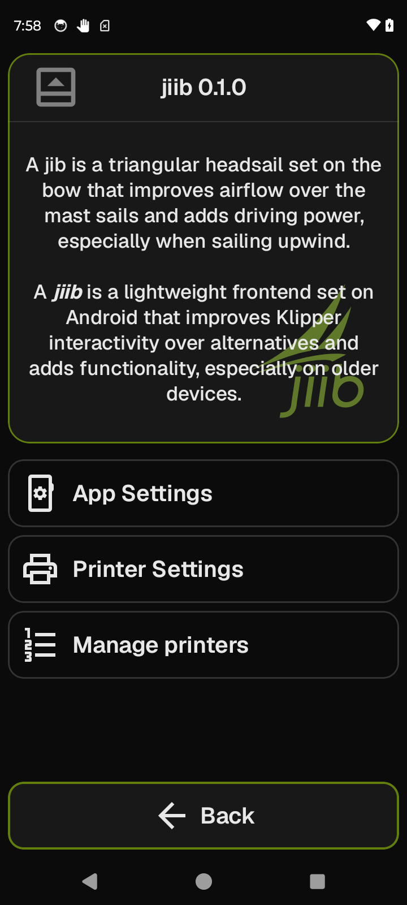

# System

The System screen is the app's about card and the hub for all settings — app-wide preferences, per-printer configuration, and printer management.

**Getting there:** Home → **System** (foot bar button, available in standby and when a print completes). While a print is running, **System** moves from the foot bar into the home list.

## The screen

The Focus card shows a static brand identity: no live telemetry, no connection state. The header reads "jiib" followed by the app version (for example, "jiib 0.1.0"). Below that are two short paragraphs — one explains the nautical term *jib* (the triangular headsail it's named after), the other explains the app name *jiib* (with "jiib" in bold italic). The jiib logo watermark sits at 45% opacity in the bottom-right corner of the card.

The list holds three navigation rows. Tapping any row navigates immediately — there is no selection state.

The foot bar has one button: **Back**.

## Options & controls

### Focus card

**Brand explainer** — static text; no user interaction. The content does not change with printer state or connection status.

### List rows

**App Settings** — opens app-wide preferences that apply across all printers (text size, interface font, data font, screen-awake toggle, webcam feature toggle).

**Printer Settings** — opens per-printer configuration for the active printer (connection details, theme, heat presets, increment values, system info, power/reset).

**Manage printers** — opens the printer list where you can add, edit, switch between, or delete printer profiles.

### Foot bar

**Back** (accent) — exits to the previous screen.

### E-stop

When a print is running or paused, the FocusFrame header icon morphs into an emergency-stop button in place of the screen icon. Tapping it raises a confirmation dialog before the stop fires; long-pressing fires the emergency stop immediately without a guard. The shell-level floating e-stop overlay does not appear on this screen; the header-docked control handles it instead.

## Related

[Home](home.md) · [Heaters](heaters.md)
