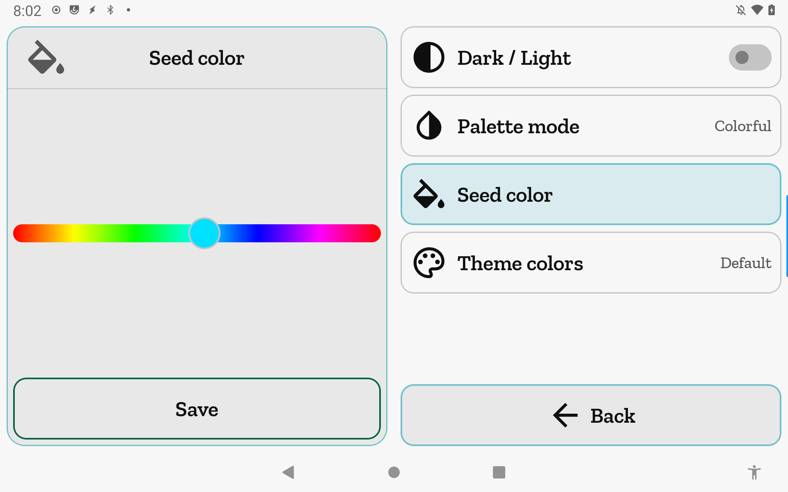
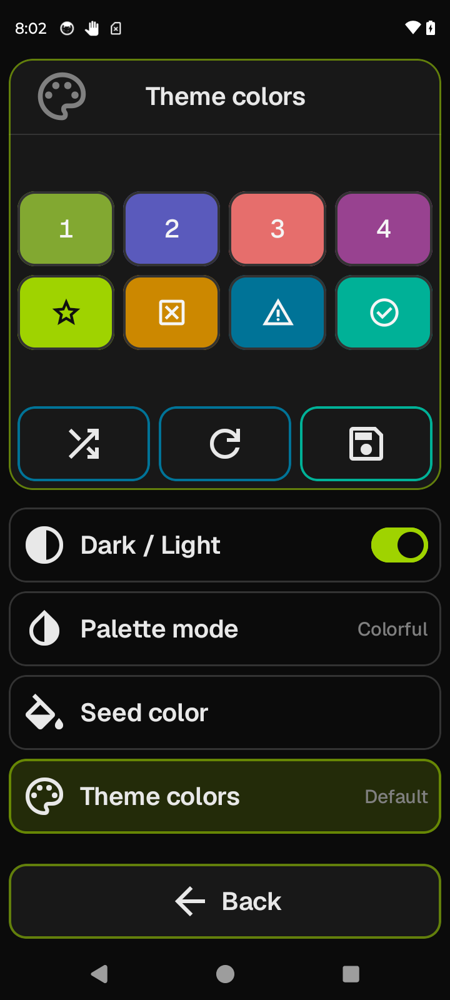

# Theme & colors

Each printer profile gets its own visual theme — dark or light, a color style, and a seed
hue that the app uses to generate the full palette. Individual colors in the generated
palette can be overridden or shuffled.

**Getting there:** Home → System → Printer Settings → Theme & colors.

## The screen

The Focus card shows a short intro when no row is selected. Tapping a row in the list swaps
the Focus card to that row's editor. The list holds four rows. The foot bar has a single Back
button that steps back through any open editor rather than leaving the screen immediately.

## Options & controls

### List rows

- **Dark / Light** — leading contrast icon; trailing inline switch toggles dark and light
  without opening the Focus card editor. Tapping the row label opens an explainer in the Focus card.
  Writes through immediately — no Save required.

- **Palette mode** — opens the palette mode selector in the Focus card. The current mode is shown
  as a trailing label. Writes through immediately — no Save required.

- **Seed color** — opens the hue slider in the Focus card. Changes are staged as a draft until
  you tap Save. No trailing indicator.

- **Theme colors** — opens the swatch grid in the Focus card. Changes are staged as a draft until
  you tap Save. Shows a trailing **Custom** indicator when any pool slot, accent, or status
  color has been manually overridden; shows **Default** otherwise.

### Focus: resting (no row selected)

Displays the intro text: "A theme is built from a seed color, a color style, and a set of
pool colors."

### Focus: Dark / Light

Displays an explainer: dark and light flip primary surfaces to their contrast; generated
colors shift to stay legible. The inline switch in the list row is the quickest way to
toggle — this Focus is informational.

### Focus: Palette mode

Three icon-only buttons in a row — tap one to select it. The active button highlights in
the accent color.

- **Colorful** — full color indicators throughout the app. All pool, accent, and status
  color overrides are applied.
- **High contrast** — major theme color and intent colors only. Status color overrides are
  stored but overridden by a fixed safety palette in this mode.
- **Simple** — theme color only. Status color overrides are stored but not rendered in this
  mode; status shapes and icons carry meaning alone.

Palette mode writes through immediately — no Save required.

### Focus: Seed color

A horizontal hue slider spanning the full color wheel (red → yellow → green → cyan → blue →
magenta → red). Drag to pick a hue. The accent and pool colors are generated from this hue
with automatic lightness for contrast; you do not set saturation or brightness here.

- **Save** (green button) — commits the draft seed and closes the editor.

Changes are live-previewed across the whole app while dragging.

### Focus: Theme colors (swatch grid)

Eight tappable swatches in two rows, each one unit tall:

**Top row — pool colors:**
- **1 / 2 / 3 / 4** — the four data pool colors generated from the seed. These appear in
  the temperature graph, status decorations, and other data surfaces.

**Bottom row — accent and status colors:**
- **Accent** (star icon) — the navigation and neutral-action color used throughout the app.
  Overrides apply in all palette modes.
- **Stop** (status-stop icon) — the stop/error status color.
- **Caution** (warning icon) — the caution/in-process status color.
- **Go** (check-circle icon) — the go/success status color.

Status color overrides (Stop, Caution, Go) are saved regardless of mode, but only take
effect in Colorful mode. In High contrast and Simple, the swatch editor displays a note
that the edit is saved for Colorful mode and will not render here.

**Three icon-only action buttons below the grid:**

- **Randomize** (amber) — clears all manual pool, accent, and status overrides and applies
  a new hue rotation (40–319° from the current rotation, guaranteed to differ visibly).
  The result is a fresh generated palette from the same seed. Staged as a draft — tap Save
  to keep it.
- **Revert** (amber) — discards the entire draft and restores the last saved state. Any
  changes made since the last Save are lost.
- **Save** (green) — commits the draft and closes the editor.

### Focus: Swatch editor

Opens when you tap any swatch in the grid. Three labeled sliders (H, S, V) let you set the
exact color. The Focus header edge shows a live color preview of the current picked value.

- **H** — hue (0–360°), full-wheel gradient track.
- **S** — saturation (0–1), track shades from the desaturated hue to the pure hue.
- **V** — value/brightness (0–1), track shades from black to the pure hue.

The color previews live across the whole app as you drag. For status swatches (Stop, Caution,
Go) in High contrast or Simple mode, a note confirms the edit is saved for Colorful mode.

- **Cancel** (red) — undoes only the changes made in this swatch editor session, restoring
  the swatch to the value it had when the editor opened. Other staged draft changes are
  unaffected.
- **Save** (green) — stages the picked color into the draft and returns to the swatch grid.
  The draft is not committed to storage until you tap Save in the swatch grid.

### Foot bar

- **Back** — steps back contextually: from the swatch editor, returns to the swatch grid;
  from any row editor, returns to the list; from the list, discards the draft and exits.
  Styled **red** (danger intent) when a draft is open — a reminder that unsaved changes will
  be discarded on exit. Styled **accent** when there is nothing to discard.

## Plumbing notes

Dark / Light and Palette mode write to DataStore immediately via `setActiveDark` /
`setActiveMode`, scoped to the active printer profile. Seed color and Theme colors changes
are held in an in-memory live-preview draft (`container.themeDraft`); `commitThemeDraft`
persists the draft to the active printer's DataStore entry on Save; `clearThemeDraft`
discards it on Revert or exit. The draft is cleared automatically when leaving the screen by
any path (foot Back, system back, navigation pop) so a dirty draft never leaks across the
app.

## Related

[Concepts](concepts.md) · [Printer Settings](printer-settings.md)
