# jiib screenshot gallery

**App version v0.1.0 · captured 2026-07-03.**

Every pair below shows the same app on two very different devices, deliberately staged to
cover both ends of the spectrum:

- **Left / wide:** Nexus 7 (2013) tablet — landscape, **light theme**, teal accent. This is
  jiib's performance-floor device (Adreno 320, 2 GB RAM, Android 11 / LineageOS).
- **Right / tall:** Moto G Play (2024) phone — portrait, **dark theme**, green accent.

Every screen works in both orientations on both devices; themes, accent colors, fonts, and
text size are all user-configurable (see [Theme & colors](#theme--colors) and
[App Settings](#system--settings)). Preset names, increment steps, and similar values you
see here are examples — they're editable, and two devices can happily disagree.

---

## Home

The home screen is a scrolling list. The top card (the **Focus**) is a live digest of the
printer: heater state, motor state, homing state, and the loaded spool's remaining weight.
Below it, one row per tool. The two foot buttons jump to [Heaters](#heaters) and
[System](#system--settings).

The two shots are complementary halves of the same list: the tablet is scrolled to the top
(active Spoolman spool, Files, Move, Extrude, Macros), the phone to the bottom
(Calibration, Temperature, Console, Fine-Tune).

<table><tr>
<td valign="top"></td>
<td valign="top"></td>
</tr></table>

**[Full options →](../manual/home.md)**

## Printing

When a job is running, home morphs into the print dashboard: progress percentage in the
header, and a stat block over the gcode thumbnail — temperatures, job/print time, filament
used, Z height, and layer count. **Pause** and **Cancel** take over the foot bar. All tools
stay reachable in the list below while printing.

<table><tr>
<td valign="top"></td>
<td valign="top"></td>
</tr></table>

**[Full options →](../manual/printing.md)**

### Paused

Pausing (manually, or automatically from a filament-runout sensor) swaps the foot bar to
**Resume** / **Cancel** and flips the header state.

<table><tr>
<td valign="top"></td>
</tr></table>

**[Full options →](../manual/printing.md)**

### Complete

When the job finishes, the dashboard freezes the final stats and offers **Dismiss** (back
to the standby home) or **System**.

<table><tr>
<td valign="top"></td>
<td valign="top"></td>
</tr></table>

**[Full options →](../manual/printing.md)**

### Fine-Tune (during a print)

**Home → Fine-Tune** while printing. Live adjustment of Print Speed, Flow Rate, Pressure
Advance, Smooth Time, Part Fan, and machine limits (Max Velocity / Accel / Min Cruise).
Pick a setting from the list, then use **− / +** with a selectable step size (±1/±5/±10
here). **Reset All** puts everything back to the sliced values.

<table><tr>
<td valign="top"></td>
</tr></table>

**[Full options →](../manual/fine-tune.md)**

## Heaters

**Home → Heaters** (foot button, available almost everywhere). One tap heats nozzle and
bed together: **OFF** kills all heaters, and below it are your named presets with their
nozzle/bed targets. Presets are per-printer and fully editable (name, temps) — see
[Heat Presets](#heat-presets) under printer settings. The two devices here show different
preset names for the same printer on purpose: rename them to whatever you like.

<table><tr>
<td valign="top"></td>
<td valign="top"></td>
</tr></table>

**[Full options →](../manual/heaters.md)**

## Temperature

**Home → Temperature.** Two modes, switched from the foot bar:

- **Monitoring** (tablet): live temperature graph of every sensor Klipper reports —
  heaters with target lines, plus passive sensors (chamber air, frame, host CPU). The row
  list shows current and target values.
- **Heater Adjust** (phone): the same graph zoomed on the heaters, with rows for setting
  nozzle/bed targets directly.

<table><tr>
<td valign="top">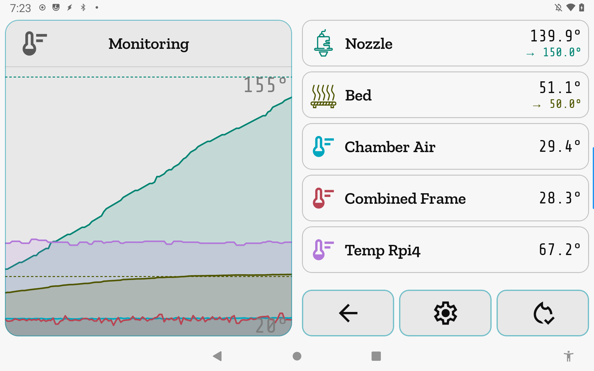</td>
<td valign="top">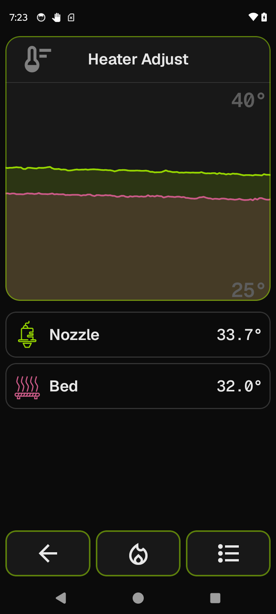</td>
</tr></table>

**[Full options →](../manual/temperature.md)**

## Files

**Home → Files.** Gcode files from the printer, with thumbnails, dates, and sizes. Sort by
**Date** or **Size** with the toggle tiles. Tap a file to load its detail card into the
Focus — estimated time, filament length/weight, layer count, model height. The foot bar
holds **Back**, **Print**, and **Delete**.

<table><tr>
<td valign="top">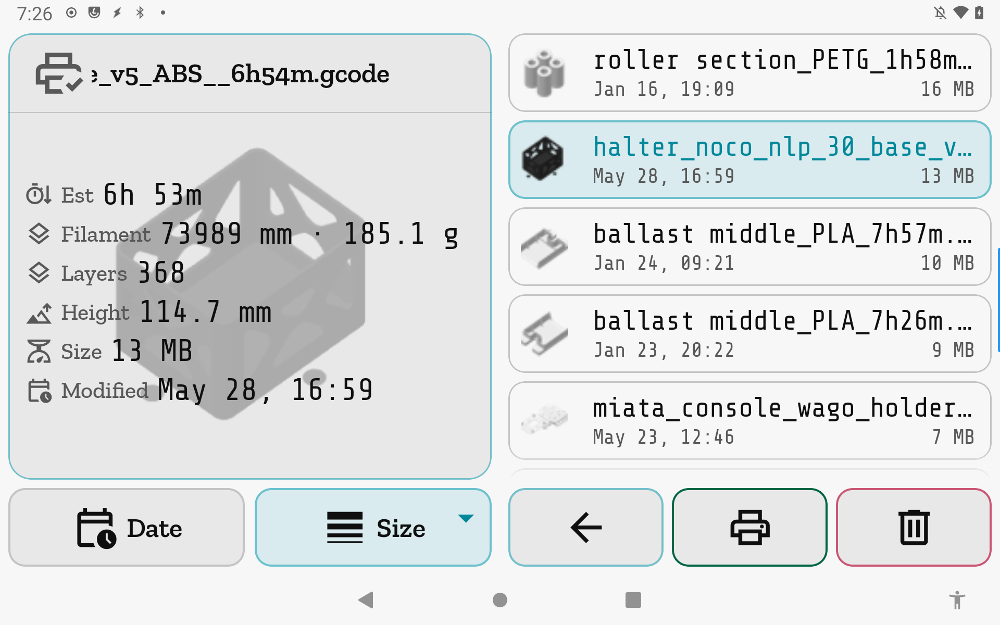</td>
<td valign="top">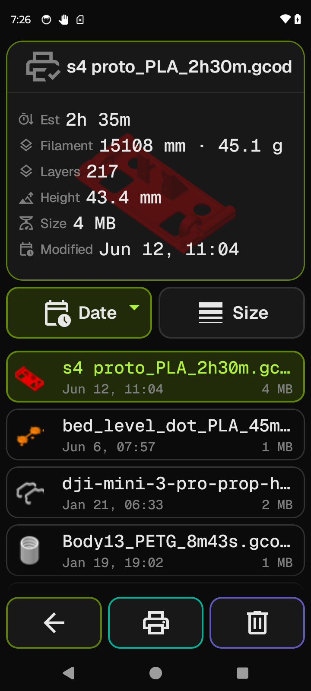</td>
</tr></table>

**[Full options →](../manual/files.md)**

## Move

**Home → Move.** A hub with several ways to move the toolhead, chosen from the list:
**Touch Move**, **XY Position**, **Z Position**, **Microstep**, plus location
**bookmarks**, live **Endstops**, and **Disable Motors**. **Home All** stays in the foot
bar throughout.

### Touch Move & XY Position

Touch Move (tablet): the Focus is a to-scale bed map — tap anywhere to send the toolhead
there, hold to refine. XY Position (phone): the same bed map plus X and Y slider rails for
axis-at-a-time moves.

<table><tr>
<td valign="top"></td>
<td valign="top"></td>
</tr></table>

**[Full options →](../manual/move.md)**

### Z Position & Microstep

Z Position (tablet): three vertical scrubbers at increasing ranges (0–10 / 0–50 / full
height) — coarse to fine on one screen. Microstep (phone): nudge any single axis by a
selectable increment (±0.1 here) with the **− / +** buttons and the X/Y/Z picker.

<table><tr>
<td valign="top"></td>
<td valign="top"></td>
</tr></table>

**[Full options →](../manual/move.md)**

### Bookmarks & Endstops

Bookmarks (tablet): save the current position under a name and jump back to it later.
Endstops (phone): live TRIGGERED/open state for each axis endstop — handy when
commissioning hardware.

<table><tr>
<td valign="top"></td>
<td valign="top"></td>
</tr></table>

**[Full options →](../manual/move.md)**

## Extrude

**Home → Extrude.** The filament hub. The Focus shows nozzle temperature and the selected
feed **Length** and **Speed** sliders, with extrude/retract buttons below. The list gathers
everything filament-adjacent: runout sensor toggles (with live "filament present" state),
filament-scoped macros from your Klipper config (e.g. `LINE_PURGE`, `M600`), and the
Spoolman spool currently linked to the printer. Foot bar: Back, Heaters, Macros.

<table><tr>
<td valign="top"></td>
<td valign="top"></td>
</tr></table>

**[Full options →](../manual/extrude.md)**

## Macros

**Home → Macros.** Every gcode macro from your Klipper config. Tap one to load it into the
Focus — its `description` from the config is shown, and macros with parameters get an input
form (tablet: `SET_PAUSE_AT_LAYER` with its LAYER/MACRO params). Execute from the foot-bar
play button. Each row's toggle **bookmarks the macro into the launcher list** for one-tap
access; underscore-prefixed helper macros are hidden unless you hit **Show**.

<table><tr>
<td valign="top">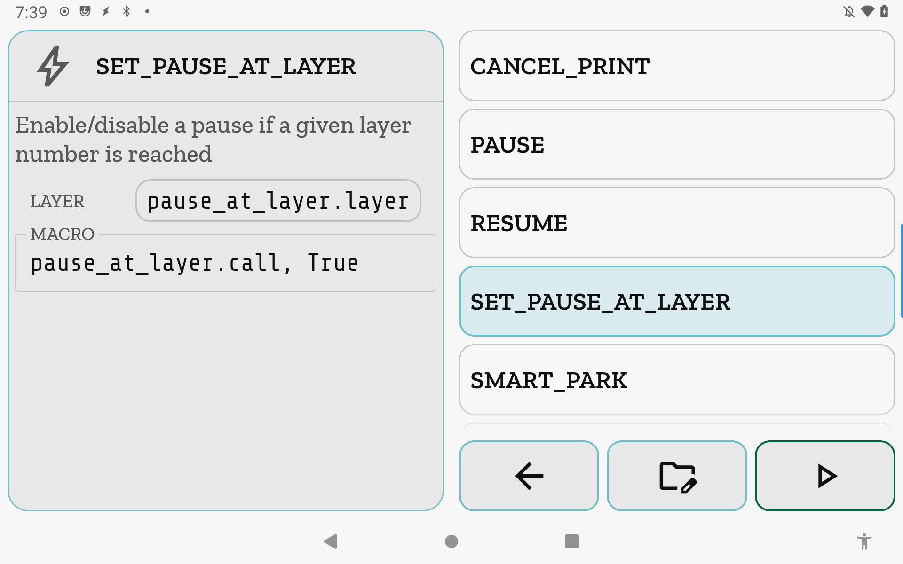</td>
<td valign="top">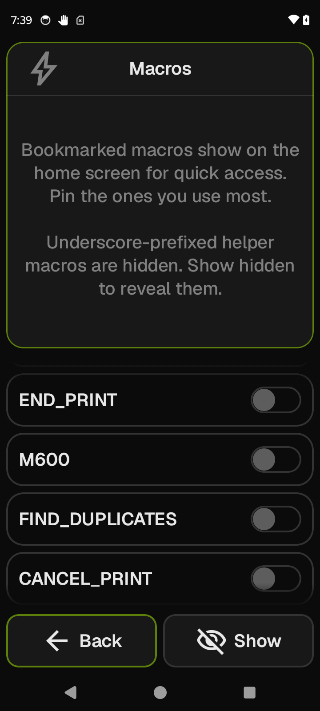</td>
</tr></table>

**[Full options →](../manual/macros.md)**

## Calibration

**Home → Calibration.** A hub for the printer's leveling and probing tools. Only the tools
your printer actually supports are enabled — here QGL is greyed out because this machine
doesn't have quad gantry leveling. Select a tool to read its description, then **Open**.

<table><tr>
<td valign="top"></td>
<td valign="top"></td>
</tr></table>

**[Full options →](../manual/calibration.md)**

### Bed Mesh

Saved mesh profiles with their measured ranges, **Calibrate** to probe a new mesh, and
**Clear Mesh** to unload. The Focus renders the mesh itself — as a top-down color map
(tablet) or an isometric wireframe (phone), switchable via **View Type**, with
configurable high/low colors and a relative/absolute color scale.

<table><tr>
<td valign="top">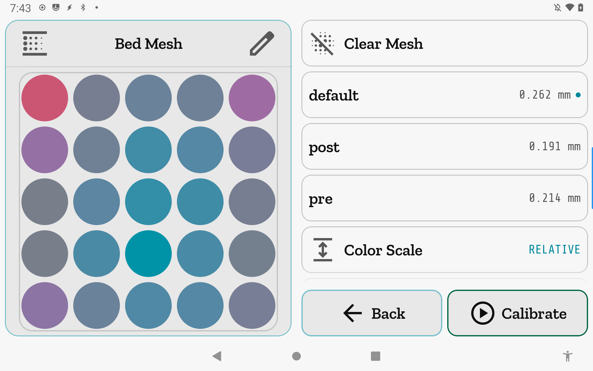</td>
<td valign="top">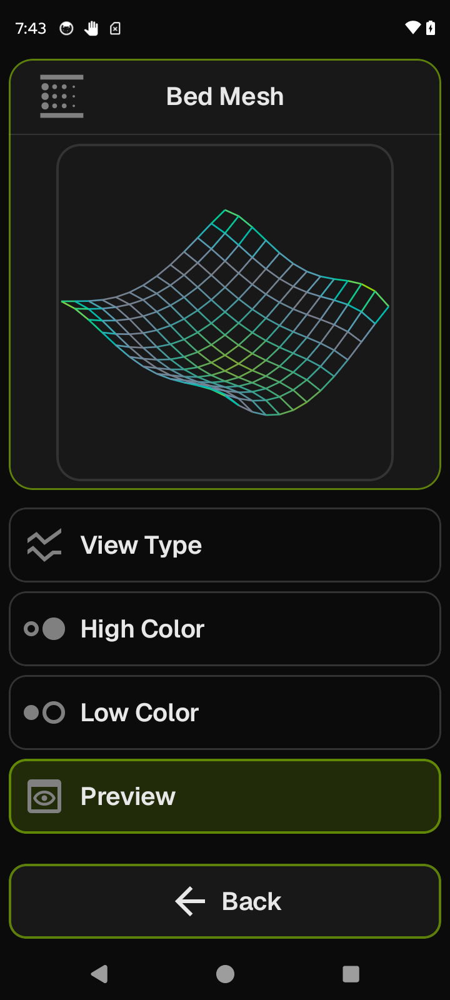</td>
</tr></table>

**[Full options →](../manual/bed-mesh.md)**

### Nozzle Distance

Everything for setting the nozzle-to-bed distance. The tablet shows probe Z-offset
calibration mid-run — jog the nozzle down with move/increment buttons until it's right,
then **Accept** (note the safety callout to stow a removable probe). The phone shows
**Live Z-Offset**: baby-step the saved `z_offset` in fine increments, with **Save** to
persist it to the config.

<table><tr>
<td valign="top"></td>
<td valign="top"></td>
</tr></table>

**[Full options →](../manual/nozzle-distance.md)**

## Console

**Home → Console.** The raw printer conversation — commands, responses, and Klipper
warnings, color-coded by kind (sent gcode, info, warnings, errors). Foot-bar toggles
filter the noise. This is the classic-Views high-performance surface: it stays
smooth even with heavy chatter on the 2013 tablet.

<table><tr>
<td valign="top">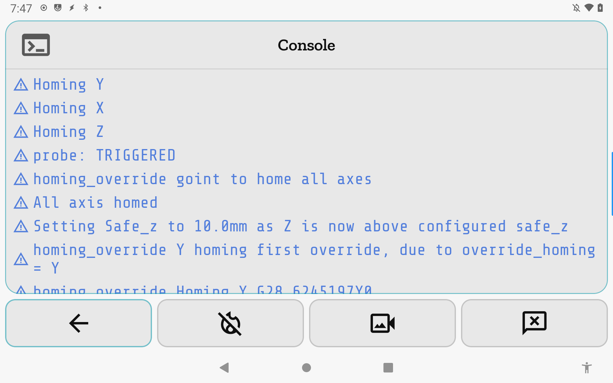</td>
<td valign="top">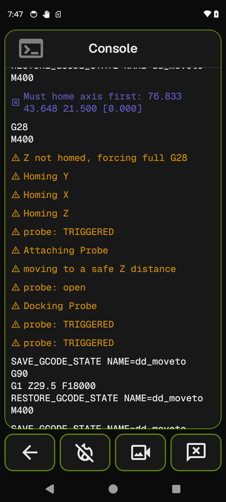</td>
</tr></table>

**[Full options →](../manual/console.md)**

## Outputs

**Home → Outputs.** Every controllable output Klipper exposes: switches, servos, fans,
LEDs, and generic pins. Tap one to control it in the Focus — the tablet shows a camera
servo with an angle slider (0–180°), the phone an addressable LED strip with H/S/V
sliders. Percentage outputs, toggles, and Off buttons appear per output type.

<table><tr>
<td valign="top"></td>
<td valign="top"></td>
</tr></table>

**[Full options →](../manual/outputs.md)**

## Spoolman

**Home →** the spool row (top of the home list, when a Spoolman server is configured).
Your filament inventory, live from Spoolman: each spool with its color, material, vendor,
and remaining weight. The Focus card shows the selected spool's remaining
weight/percentage, print temps, and date added. The **Loaded** badge marks what's on the
printer — tap-to-load tracks usage against the right spool. Sort tiles cover name, date,
weight, material, color, and vendor; the foot bar has a QR scanner for jumping straight to
a spool from a printed label.

<table><tr>
<td valign="top">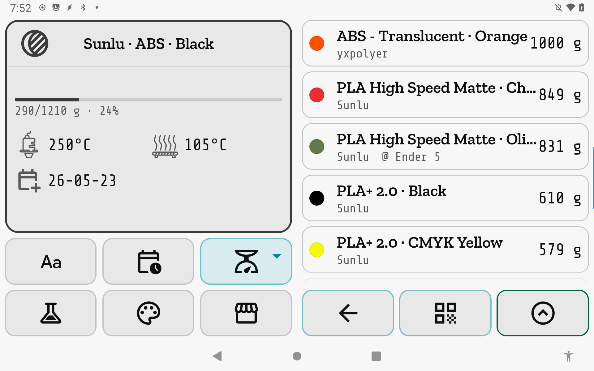</td>
<td valign="top">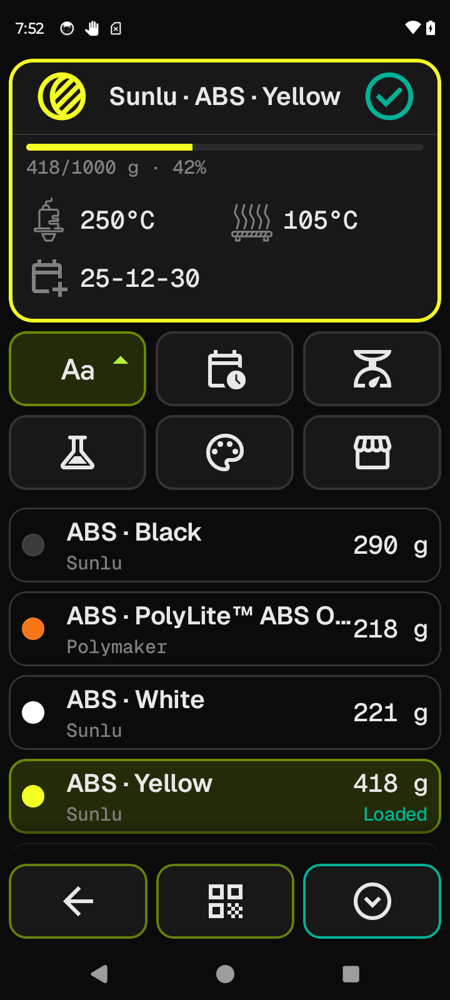</td>
</tr></table>

**[Full options →](../manual/spoolman.md)**

### Filters

The sort tiles double as filters: material chips (tablet — multi-select PLA / PETG /
ABS-ASA / TPU) and color families (phone — twelve named families, so "Yellow" finds every
yellowish spool regardless of exact hex). **Clear** resets, **Done** applies.

<table><tr>
<td valign="top">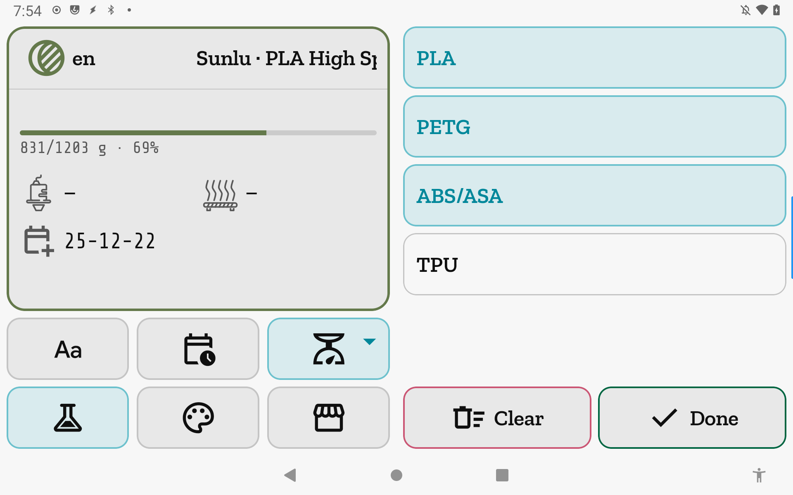</td>
<td valign="top">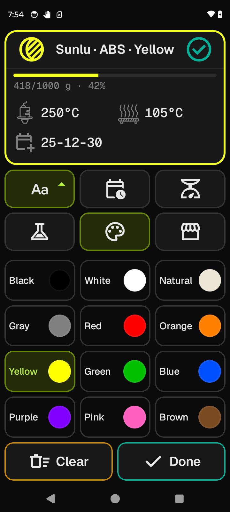</td>
</tr></table>

**[Full options →](../manual/spoolman.md)**

## System & settings

**Home → System.** The about card (with the app version and the obligatory sailing
trivia), and doors to **App Settings**, **Printer Settings**, and **Manage printers**.

<table><tr>
<td valign="top"></td>
</tr></table>

**[Full options →](../manual/system.md)**

### App Settings

App-wide preferences that follow the device, not the printer: **Text size** (S/M/L, shown
selected in the Focus), **Interface font** and **Data font** (pick from the bundled
library — Zilla Slab + Share Tech Mono here, which is why these two devices look different
from each other), **Keep screen awake**, and the **Webcam** feature toggle.

<table><tr>
<td valign="top"></td>
</tr></table>

**[Full options →](../manual/app-settings.md)**

### Printer Settings

Per-printer configuration: **Connection**, **Theme & colors**, **Heat Presets**,
**Increment Values**, **System Info**, and **Power / Reset**. The Focus confirms which
printer you're editing and its connection state.

<table><tr>
<td valign="top"></td>
</tr></table>

**[Full options →](../manual/printer-settings.md)**

### Manage printers

Multiple printers, one app. **Add** one manually, or **Find on network** to discover
Moonraker instances via mDNS and add them with a tap. Tap a printer to make it active;
**Edit** to change or delete a profile. New profiles auto-name themselves from the
printer's hostname.

<table><tr>
<td valign="top"></td>
</tr></table>

**[Full options →](../manual/manage-printers.md)**

### Theme & colors

**Printer Settings → Theme & colors.** Each printer gets its own look — useful at a glance
when you run more than one. **Dark / Light** toggle, **Palette mode**, and a **Seed color**
hue slider that generates the whole theme from one color (tablet). **Theme colors** (phone)
shows the generated accents and status colors, with shuffle / reset / save — or leave it
on Default.

<table><tr>
<td valign="top"></td>
<td valign="top"></td>
</tr></table>

**[Full options →](../manual/theme.md)**

### Increment Values

**Printer Settings → Increment Values.** The step sizes offered by every adjustment
control in the app are yours to define — comma-separated lists per control (Print Speed,
Flow Rate, Pressure Advance, Smooth Time, Part Fan, machine limits, and more). The tablet
shows Pressure Advance steps being edited.

<table><tr>
<td valign="top"></td>
</tr></table>

**[Full options →](../manual/increments.md)**

### Heat Presets

**Printer Settings → Heat Presets.** The presets that appear on the [Heaters](#heaters)
screen: add (foot bar), delete, or **Edit** a preset's name and nozzle/bed targets.

<table><tr>
<td valign="top"></td>
</tr></table>

**[Full options →](../manual/heat-presets.md)**

### Power / Reset

**Printer Settings → Power / Reset.** Host **Reboot** and **Shutdown** (when the printer's
service manager supports them), plus **Restart Moonraker**, **Firmware Restart**, and
**Restart Klipper** — which work on any setup. Destructive actions are styled in the
danger color and confirm before firing.

<table><tr>
<td valign="top"></td>
</tr></table>

**[Full options →](../manual/power-reset.md)**

### System Info

**Printer Settings → System Info.** A read-only browser of the printer's brain: the host
board (architecture, cores, RAM, OS, kernel, uptime, live CPU load and temperature) and
every MCU Klipper talks to — mainboard, toolhead boards, expanders — with firmware
versions and load.

<table><tr>
<td valign="top"></td>
</tr></table>

**[Full options →](../manual/system-info.md)**
